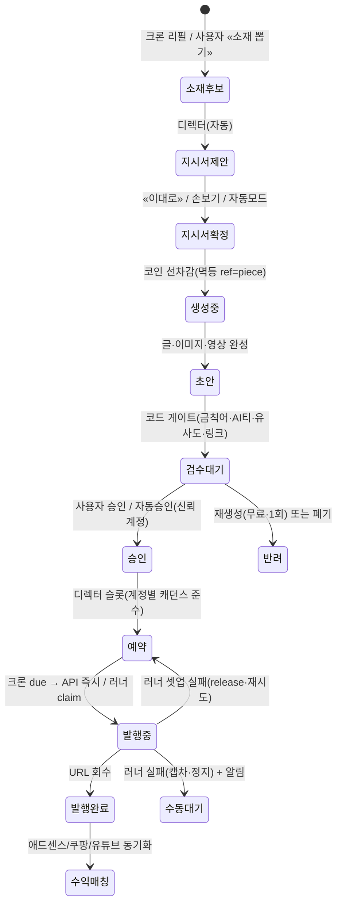

# AutoCreate 시스템 설계서 v1

> 작성 2026-09-14 · 상태 **초안(사장님 검토 대기)** · 정본 위치 `docs/DESIGN.md`
> 출처: AutoMarketing(AM) 코드 실측(`../AutoMarketing/lib`·`scripts`·`db/schema.ts`), 싸이렌MIS SSO 실측(`../tbfa-mis/netlify/functions/sso-marketing.ts`), 외부 채널 정책 조사(2026-09).

---

## 0. 한 줄 정의

**AutoCreate(AC)** = 부수입을 원하는 개인이 **여러 계정**으로 **글**과 **영상**을 AI로 만들어 **자동 발행**하고, 거기서 나온 **광고·제휴 수익을 한 곳에서 보는** 토스형 SaaS.

AM이 "회사의 마케팅 직원"이라면 AC는 "**개인의 수익 공장**"이다. 엔진(소재·디렉터·글·이미지·쇼츠·러너·코인·SSO)은 AM에서 떼어 오고, **겉(제품 정의·화면·계정 모델·수익 집계)은 새로 짠다.**

### 설계 원칙 6가지

| # | 원칙 | 뜻 |
|---|---|---|
| 1 | **디렉터가 앞에 선다** | 소재를 받으면 «어느 채널·어느 계정에·어떤 감성·어떤 구성으로·언제»를 디렉터가 먼저 정한다. 사람은 그 지시서를 «이대로» 또는 «손보기»만 한다. |
| 2 | **채널 감성 자동 적응** | 같은 소재도 네이버 블로그·티스토리·쇼츠·클립은 다른 글이다. 채널별 톤·구성 계약(AM `content-tone`)이 정본. |
| 3 | **API 있으면 API, 없으면 러너** | 발행 경로는 채널 레지스트리 한 곳이 결정한다. 화면·큐·상태기계는 경로를 모른다. |
| 4 | **계정은 소모품, 수익은 계속** | 한 계정 정지 → 같은 채널의 다음 건강한 계정으로 자동 승계. 계정 간 글 중복 0. |
| 5 | **한 화면 한 목적(토스형)** | 큰 숫자 하나·CTA 하나·설명 한 문장. 옵션은 바텀시트로 숨긴다. |
| 6 | **AI 이름은 한 파일** | 모델명은 `lib/ai-models.ts`에만 산다. 업데이트는 자동 검증→(자동/수동) 승격→롤백 가능. |

### 이 설계에서 확인이 필요한 것 (사장님 결정)

| # | 질문 | 이 문서의 가정 |
|---|---|---|
| Q1 | "S스토리"는 **티스토리**가 맞는가? | 티스토리로 가정(애드센스 대표 채널). |
| Q2 | 구독 가격 (§12 3안) | Starter 19,000 · Pro 49,000 · Agency 149,000 /월 |
| Q3 | **관리형 러너**(우리 서버가 대신 브라우저 발행) 제공 여부 | ✅ **결정(사장님 2026-09-15): 관리형이 기본이다.** 요금 단위 = **계정당 월요금** · **프록시 비용 포함**. 고객 PC 러너는 남겨 두되 «직접 돌리고 싶은 사람»의 선택지다. 원가표 `docs/active/2026-09-15-proxy-cost.md`. |
| Q4 | 유튜브·틱톡 API 앱 심사를 **우리 앱 하나**로 받고 고객이 OAuth로 붙는 방식 동의 여부 | 동의 가정(고객이 각자 앱을 만드는 건 비현실적). |
| Q5 | 계정별 **프록시(IP 분리)** 제공 여부 | ✅ **결정(사장님 2026-09-15): «계정 하나 = IP 하나».** 관리형에 **포함**한다(§7.3b). 이유는 연좌제 — 한 계정이 정지되면 같은 IP 의 다른 계정까지 죽어 수익이 통째로 끊긴다. «내 프록시 등록»(`proxy_url`) 필드는 그대로 남는다. |
| Q6 | 브랜드 컬러·로고 | **잉크 블랙 액센트**(v3 · 블루 제거). 별도 브랜드색은 토큰 `--brand` 하나로 교체 가능. |
| Q7 | 체험 중 «첫 충전 소액팩 ₩5,000=10코인» 둘지(§12.3) | 둔다(1회 한정). |

---

## 1. 제품 범위

### 1.1 사용자
- **주 사용자**: 부수입 목적의 개인(직장인·주부·프리랜서). 계정 2~30개. 하루 5~15분만 쓰고 싶어 한다.
- **부 사용자**: 소규모 대행/스튜디오(Agency 플랜·팀 시트).
- **운영자**: 우리(싸이렌MIS에서 SSO 진입 · super_admin/admin/operator).

### 1.2 두 축 × 여섯 단계

```
        소재(AI 트렌드) → 디렉터(구성·배치) → 제작 → 검수 → 발행(자동/예약) → 수익 집계
 글  축 ──────────────────────────────────────────────────────────────────────▶
 영상 축 ──────────────────────────────────────────────────────────────────────▶
```

### 1.3 비범위(v1에서 안 한다)
- 광고 집행(AM의 광고 엔진 전체) — AC는 **무료 채널 오가닉**만.
- 리드·너처링·CRM — 없음.
- 라이브 스트리밍(치지직·SOOP), 롱폼 유튜브 편집.

---

## 2. 채널 매트릭스 (조사 2026-09 · 코드 정본 3곳 = `lib/accounts.ts`(ALL_CHANNELS·connectMethodOf) + DB `channel_registry`(상태·최적시간) + `lib/runner-jobs.ts publishJobKindOf`(발행 경로))

### 2.1 글 채널

| 채널 | 붙일 수 있는 수익 | 발행 방식 | AM 자산 | 우선순위 |
|---|---|---|---|---|
| **네이버 블로그** | 애드포스트 · 쿠팡파트너스 · 네이버 쇼핑커넥트 · 제휴링크 | **러너**(글쓰기 API 없음·스마트에디터 ONE) | `scripts/naver-blog-runner.mjs` · `content-runner-core.mjs` 이식 | P1 |
| **티스토리** | 애드센스 · 카카오 애드핏 · 제휴 | **러너**(Open API 2024-02 종료) | 러너 코어 재사용·에디터 셀렉터 신규 | P1 |
| **구글 블로거(Blogspot)** | 애드센스 | **API**(Blogger API v3·OAuth) | 신규 커넥터 | P1 |
| **워드프레스**(자체호스팅·WP.com) | 애드센스 · Ezoic · 제휴 | **API**(REST + Application Password / WP.com OAuth) | 신규 커넥터 | P2 |
| **네이버 클립 «게시물형»**(텍스트+이미지) | 클립 인센티브(2026 게시물형 확대) | 러너(모바일 중심 → 검증 필요) | — | P3 |
| 쓰레드 | 직접 수익 없음 · 유입/제휴 | API | `publish-threads.ts` | P2(보조 배포) |
| 인스타 피드·카드뉴스 | 제휴 | API | `publish-instagram.ts` | P2(보조) |
| 페이스북 페이지 | 인스트림·제휴 | API | `publish-facebook.ts` | P3 |
| X(트위터) | 프리미엄 광고수익 공유 | API(유료) | — | P4 선택 |
| 브런치스토리 | 광고 불가(구독·제휴 유도) | 러너(작가 승인 필요) | — | P4 |
| 미디엄·서브스택 | 파트너 KR 미지원 / 유료구독 | API 제한·없음 | — | 보류 |

### 2.2 영상 채널

| 채널 | 붙일 수 있는 수익 | 발행 방식 | 제약 | 우선순위 |
|---|---|---|---|---|
| **유튜브 쇼츠** | YPP 쇼츠 광고수익(애드센스) · 유튜브 쇼핑 제휴 · 설명란 쿠팡 | **API**(Data API v3 `videos.insert`) | **앱 심사 전 업로드는 비공개 고정** · 일 쿼터 10,000u(업로드 1,600u ≈ 6건/일/프로젝트 → 쿼터 증설 신청) | P1 |
| **네이버 클립** | 광고 인센티브(정식) · 피드형 보상(시범→정식) · 쇼핑커넥트 | **러너**(API 없음) | PC 업로드 경로 검증 필요 → 실패 시 Android 에뮬 자동화 | P1 |
| **인스타 릴스** | 직접 수익 없음(초대제 보너스) · 제휴 | API(REELS 컨테이너·폴링) | `publish-instagram.ts` REELS 로직 이식 | P2 |
| **쓰레드 영상** | 없음 · 유입 | API | `publish-threads.ts` 확장(VIDEO) | P2 |
| **틱톡** | 크리에이터 리워드 **KR 미지원(확인 필요)** · 제휴 | API(Content Posting) | 심사 전 «본인만 보기» 고정 | P3 |
| 페이스북 릴스 | 인스트림(초대) | API | — | P3 |
| 유튜브 롱폼 · X 영상 | YPP / 프리미엄 | API | — | P4 |

### 2.3 수익 매체(광고·제휴)와 «집계» 가능성

| 수익 매체 | 성격 | 수익 데이터 회수 | 글 단위 귀속 |
|---|---|---|---|
| 구글 **애드센스** | 광고 | **API**(AdSense Management API·OAuth·일별 리포트) | 사이트/채널 단위(URL 채널 설정 시 페이지 단위 가능) |
| 네이버 **애드포스트** | 광고 | API 없음 → **러너 스크랩**(adpost.naver.com 리포트) | 미디어(블로그) 단위 |
| 카카오 **애드핏** | 광고 | API 없음 → 러너 스크랩 / 수동 | 매체 단위 |
| **유튜브 파트너**(YPP) | 광고 | **API**(YouTube Analytics `estimatedRevenue`·monetary 스코프) | 영상 단위 ✔ |
| **네이버 클립 인센티브** | 플랫폼 보상 | 러너 스크랩(크리에이터 센터) | 클립 단위 |
| **쿠팡 파트너스** | 제휴(CPS) | **API**(Reports/commission·익일 12:30 이후) | **subId = piece id → 글 단위 ✔** |
| 알리익스프레스 어필리에이트 | 제휴 | API | 트래킹ID → 글 단위 ✔ |
| 링크프라이스 · 텐핑 · 애드픽 | 제휴 | API(링크프라이스) / 수동 | 부분 |
| 네이버 쇼핑커넥트 | 제휴 | 러너/수동 | 부분 |
| 메타 보너스 · 틱톡 리워드 · X 프리미엄 | 플랫폼 보상 | 수동 입력 | — |

> **집계 설계 결론**: 소스별 «자동(API) / 반자동(러너) / 수동(입력)» 3등급을 두고, 화면은 등급을 숨기지 않는다(«어제 12:30 기준 · 러너 회수»처럼 신선도를 표기). 제휴 링크는 **전부 piece id를 subId로 심어** 글/영상 단위 수익을 잡는다.

---

## 3. 아키텍처

### 3.1 스택 (AM·MIS와 동일 — 엔진을 «파일째» 옮기기 위함)

| 영역 | 기술 | 이유 |
|---|---|---|
| Frontend | Vanilla HTML/CSS/JS **모바일 퍼스트 PWA** + 새 디자인 시스템(`public/css/ac.css`) | AM `shell.js`·컴포넌트 관례 재사용. 토스형은 프레임워크가 아니라 규율의 문제. |
| Backend | Netlify Functions v2(Node 20) · TypeScript | AM `lib/*.ts` 무수정 이식 가능 |
| DB | Neon PostgreSQL + Drizzle (신규 인스턴스 `autocreate`) | AM 스키마 패턴·`scripts/neon-migrate.mjs` 그대로 |
| AI | Gemini(`lib/ai-models.ts` 단일 출처) · 이미지 `CHAIN_IMAGE` · TTS · 영상 provider 레지스트리(`video-providers`) | AM 실측 체인 |
| 러너 | Node + Playwright(크로미움) + ffmpeg · Windows 런처(`run.bat`) + zip 배포·자동 업데이트(R7) | AM `content-runner-core.mjs`·`creative-render.ts` |
| 스토리지 | Cloudflare R2(이미지·영상·프레임) | AM presigned PUT 관례 |
| 결제 | KICC(`lib/kicc.ts`·`billing.ts`·`coin-purchase.ts`) | AM 라이브 코드 |
| Cron | Netlify Scheduled + GitHub Actions 보조 | AM 관례 |
| 배포 | GitHub `endyd116-dot/AutoCreate` → Netlify `autocreate-endyd` (연동 완료) | |

### 3.2 구성도

```mermaid
flowchart LR
  subgraph Client[고객 화면 · PWA]
    UI[홈 / 만들기 / 편성표 / 수익 / 내 계정]
  end
  subgraph Edge[Netlify Functions]
    API[/api/* 핸들러]
    DIR[디렉터 엔진]
    GEN[글·이미지·쇼츠 생성]
    PUB[발행 디스패처]
    REV[수익 수집기]
    CRON[크론: 소재 리필·예약 발행·수익 동기화·AI 모델 감시]
  end
  DB[(Neon PostgreSQL)]
  R2[(R2 스토리지)]
  subgraph Runner[AutoCreate 러너 · 관리형(기본) 또는 고객 PC]
    RQ[큐 소비: 발행·렌더·세션·수익 스크랩]
    BR[계정별 브라우저 프로필]
  end
  subgraph Ext[외부]
    APIC[API 채널: 블로거·WP·유튜브·인스타·쓰레드·틱톡]
    RUNC[러너 채널: 네이버 블로그·티스토리·클립]
    ADS[수익 API: 애드센스·유튜브 애널리틱스·쿠팡·알리]
  end
  MIS[싸이렌 MIS 허브 SSO]
  UI --> API --> DB
  API --> DIR --> GEN --> R2
  CRON --> PUB
  PUB -->|API 채널| APIC
  PUB -->|러너 채널| RQ --> BR --> RUNC
  REV --> ADS
  RQ -->|애드포스트·클립 스크랩| REV
  MIS -->|60초 토큰| API
```

### 3.3 AM 재사용 맵

| AC 모듈 | AM 원본 | 처리 |
|---|---|---|
| 인증·세션·운영자 | `lib/auth.ts` · `admin-guard.ts` · `sso-role.ts` · `sso-enter.ts` | **그대로**(aud만 `autocreate`) |
| 테넌트·플랜 게이트 | `plan-gate.ts` · `ops-tenants.ts` | 플랜 표만 교체 |
| 코인 | `coin-ledger.ts` · `coin-purchase.ts` · `coin-invoice.ts` · `coin-refund.ts` · `coin-reconcile.ts` | **그대로**(구간표 동일) |
| 결제 | `kicc.ts` · `billing.ts` · `billing-math.ts` | 그대로 |
| AI 호출·캐시·미터 | `ai.ts` · `ai-models.ts` · `ai-cache.ts`(R7 이식) · `ai-cost.ts` | 그대로 + §10 오버레이 · `ai-meter` → `lib/billing/ai-cost-cap.ts` 로 흡수 · **`ai-key`(키 로테이션)는 R8**(키가 1개라 지금은 아프지 않다) |
| 소재 | `content-topics.ts`(스코어링·퍼널) · `shorts-topics.ts`(뱅크·30일 중복) · 네이버 검색량(`naver-keyword-acquire`의 조회 프리미티브) | **일반화**: 세그먼트→«수익 니치» 입력으로 |
| 디렉터 | `content-director.ts`(사실수집·컨셉·장면·채널문법·AI티 검사) · `content-tone.ts`(채널 톤·구성 5종 로테이션) | **확장**: 다채널 배치·계정 배정·감성 프로파일 |
| 글 생성 | `content-gen.ts` · `content-image.ts` | 그대로 · **썸네일·태그는 AC 자체 구현**(태그 = `hashtags` 블록을 채널별 집필 계약이 정한다 · 대표 이미지 = 본문 첫 사진) — 두 파일을 만들지 않는다 |
| 쇼츠 공장 | `shorts-script.ts`(팩트체크 대본) · `shorts-scenes.ts` · `creative-render.ts` · `creative-tts.ts` · `shorts-captions.ts` · `video-render.ts`(BGM) · `video-providers/*` · `shorts-loop.ts` | 이식 + 디벨롭(§6) |
| 발행 커넥터 | `publish-threads/instagram/facebook.ts` · `naver-publish-verify.ts` | 그대로 + 신규(블로거·WP·유튜브·틱톡) |
| 주소 정본 | `lib/site-url.ts` — 🔴 **`backgroundBase()`(지금 이 배포가 자기를 부르는 주소)와 `publicBase()`(고객에게 주는 정본 주소)는 다르다.** 하나로 두면 로컬 개발이 **라이브 배경 함수를 부른다**(2026-09-15 실제 사고 · AC-53/54) | AC 신규 |
| 러너 | `content-runner.ts`(큐 상태기계) · `runner-jobs.ts` · `runner-block.ts`(차단 사유 분류) · `scripts/content-runner-core.mjs` · `naver-blog-runner.mjs` · `run.bat`(zip 배포 · `scripts/build-runner.mts`) | 이식 + 다계정 프로필(§8) |
| 채널 자격 | `channel-creds.ts`(AES-256-GCM) · `channel-accounts.ts`(연결 상태 판정) | **핵심 변경**: 테넌트당 1연결 → **계정 N개** |
| 품질 게이트 | `ad-law-banned.ts`(광고법 금칙어) · `ad-copy-similarity.ts`(유사도) · `content-link-verify.ts` | 그대로(계정 간 중복 검사에 재사용) |
| 알림·감사 | `audit.ts` · notifications 계열 | 그대로 |

**안 가져오는 것**: 광고 집행(`ad-*`, `ads-*`, `adgroup-*`, `bid-*`, `budget-*`) · 리드/너처링 · 랜딩 · 제안서 · 두뇌(brain) · 챗 에이전트.

---

## 4. 핵심 파이프라인 · 상태기계

### 4.1 객체 4개

| 객체 | 뜻 | 상태 |
|---|---|---|
| **topic**(소재) | «무엇에 대해» — 주제·앵글·검색량·수익 태그 | `candidate → picked → used / expired(7일)` |
| **brief**(제작 지시서) | 디렉터의 결정 — 채널×계정×감성×구성×일정 | `proposed → confirmed(자동 or 사람) → producing → done` |
| **piece**(산출물) | 글/영상 1건 = 채널 1개·계정 1개 | `generating → draft → in_review → approved → scheduled → publishing → published` / `awaiting_manual` / `failed` / `rejected` |
| **post**(발행 결과) | 외부 URL·채널 ref·발행 시각·회수 통계 | 불변 이력 |

한 brief는 piece를 N개 낳는다(예: 소재 1개 → 네이버 블로그 계정A 경험담 + 티스토리 계정B 정보형 + 쇼츠 계정C 60초).

### 4.2 흐름



### 4.3 불변식
- **코인은 piece 단위 1회**(AM `consumeCoins` 멱등 ref). 재생성·수리·재시도 무료.
- **발행 멱등**: `channel_ref` 또는 `external_url` 있으면 재게시 금지.
- **계정 캐던스**: 계정별 `daily_cap`·`min_gap_min`을 예약 슬롯이 넘지 못한다(정지 예방).
- **계정 간 중복 0**: 같은 brief의 piece끼리 본문 유사도 > 임계면 디렉터가 앵글을 바꿔 다시 쓴다(`ad-copy-similarity`).
- **광고 표시 의무 자동 삽입**: 제휴 링크 포함 piece는 채널별 고지 문구(«쿠팡 파트너스 활동의 일환으로…»)를 코드가 넣는다. 사람이 지워도 발행 직전 다시 검사.

---

## 5. 디렉터 (모든 기능의 앞)

### 5.1 정의
디렉터 = **소재 1개 + 계정 풀 + 목표(수익 매체)**를 입력받아 **제작 지시서(brief)**를 내는 결정 계층. 글쓰기·영상 엔진은 지시서만 본다(AM `content-director`의 «앞뒤만 한다» 원칙 유지 — 두뇌를 하나 더 만들지 않는다).

### 5.2 지시서 스키마

```ts
interface ProductionBrief {
  id: string; tenantId: number; topicId: string;
  goal: "adsense" | "adpost" | "affiliate" | "ypp" | "clip_incentive" | "mixed";
  pieces: Array<{
    channel: ChannelKey;            // naver_blog | tistory | blogger | wordpress | youtube_shorts | naver_clip | reels | threads | tiktok ...
    accountId: number;              // 계정 풀에서 배정(건강도·캐던스·페르소나 적합도)
    format: "longform" | "listicle" | "qna" | "compare" | "story" | "cardnews" | "shorts_graphic" | "shorts_talk" | "clip_life";
    emotion: EmotionProfile;        // §5.4
    composition: CompositionKey;    // AM 구성 5종 + 신규(수익형: 비교표·체크리스트·후기모음)
    lengthHint: { words?: number; seconds?: 15|30|60 };
    images: { count: number; style: "photo"|"illust"|"infographic"; heroNeeded: boolean };
    monetize: { affiliate?: { provider: "coupang"|"ali"|"linkprice"; productQuery: string; slot: "mid"|"end"|"both" }; adDisclosure: boolean };
    schedule: { at: string; slotReason: string };   // 계정 캐던스·채널 골든타임
    coinCost: number;               // 표시용(정본은 coin-ledger)
  }>;
  reasons: string[];                // «왜 이 배치인가» 사람말 3줄
  mode: "auto" | "reviewed";
}
```

### 5.3 자동 디렉터 결정 규칙(결정론 우선 · LLM은 앵글/감성만)
1. **채널 선택**: 소재의 `channel_hint`(AM `inferChannelHint`) × 사용자가 켠 채널 × 목표 매체. 예: `goal=adsense` → 티스토리/블로거 우선, `adpost` → 네이버 블로그.
2. **계정 배정**: 채널 내 계정 중 `status=active` · 오늘 발행 < `daily_cap` · `health_score` 높은 순 · 페르소나-소재 적합도(LLM 1콜). 같은 소재를 두 계정에 낼 땐 **앵글을 갈라** 배정.
3. **구성 로테이션**: 그 계정의 **직전 글과 같은 구성 금지**(AM `content-tone` 로테이션).
4. **일정**: 채널 골든타임 표 × 계정 `min_gap` × 하루 분산.
5. **수익 슬롯**: 소재의 «상업 의도 점수» ≥ 임계면 제휴 상품 슬롯 배정(쿠팡 검색 API로 상품 후보 3개).
6. **코인 미리보기**: piece별 `coinCostOf(item)` 합계를 지시서에 표기 — 확정 전 총액을 본다.

### 5.4 감성 프로파일(채널 감성 자동 적응)

| 채널 | 기본 감성 | 톤 계약(AM `CHANNEL_TONE` 확장) |
|---|---|---|
| 네이버 블로그 | 경험담·친근 | 구어 «~했어요/~더라고요» · 사진 6~10장 · 소제목 인용구 · 해시태그 |
| 티스토리 | 정보·정리 | 소제목 H2/H3 · 표·체크리스트 · 서론-본론-결론 · 애드센스 삽입 자리(중간/끝) |
| 블로거·WP | SEO 정보 | 메타 설명 · FAQ(AEO) · 1,200~1,800자 |
| 쓰레드 | 훅·짧게 | 첫 줄 훅 · 3~5줄 · 댓글에 링크 |
| 유튜브 쇼츠 | 3초 훅·자막 본체 | 문장 4~10 · 반전/문제해결 · 무음 시청 전제(AM `creative-tts` 원칙) |
| 네이버 클립 | 생활밀착·네이버 톤 | 15~30초 · 상단 자막 크게 · 쇼핑커넥트 태그 |
| 릴스 | 감성 b-roll | 텍스트 오버레이 · BGM 무드 |

프로파일은 **DB 표(`emotion_profiles`) + 코드 기본값**. 운영자가 화면에서 조정 가능(코드 재배포 0).

### 5.5 디렉터 화면(토스형)
- 자동안을 **카드 한 장**으로 보여준다: «네이버 블로그(계정 @a) 경험담 · 티스토리(@b) 비교표 · 쇼츠(@c) 60초 — 총 30코인 · 내일 09:00/12:00/19:00».
- CTA 두 개뿐: **«이대로 만들기»** / «손보기». 손보기 = 바텀시트(채널 토글·계정 선택·감성 칩·구성 칩·이미지 수·제휴 상품·시각).
- «디렉터에게 맡기기» 스위치 ON이면 이 화면을 건너뛴다(자동모드·신뢰 계정만 자동승인).

---

## 5B. 편성표 — 자동 스케줄러 (사장님 요청 2026-09-14)

### 5B.0 한 줄
**규칙 한 번 → 소재는 편성자가 → 발행 D-3에 자동 제작 → 3일 검수창 → 당일 채널별 최적 시간에 자동 발행.** 작게는 1주, 많게는 한 달치가 스스로 굴러간다.

### 5B.1 메뉴 이름 — 추천 **«편성표»**
- 방송국 용어라 «디렉터»와 짝이 맞고, 사람말이며 두 글자다. 「자동화 스케줄링」은 시스템 용어(헌장 금지).
- **하단 탭 «발행함» → «편성표»로 교체**한다(탭 5개 유지). 발행 결과도 편성표 달력의 «발행됨» 칩으로 보이므로 발행함이 따로 필요 없다.
- 켜는 동작의 이름: **«자동 편성 켜기»**. 홈의 «디렉터에게 맡기기» 토글은 이 기능의 별칭이 된다(둘이 같은 설정을 가리킨다 — 정본은 편성표).
- 차선: «루틴», «달력». 비추: «오토파일럿»(AM 용어·고객에겐 낯설다).

### 5B.2 흐름(시간축)

```
D-∞  규칙 설정(1회)   채널 × 계정 × 종류 × 빈도(일/주/월) × 선호 시간 → cadence_rules
D-7  소재 편성        편성자(AM editorial-board)가 다음 1주(또는 2주·4주) 슬롯마다 소재·앵글 배정 → 알림 «다음 주 소재 12개 정했어요»
D-3  자동 제작        (produceLeadDays 기본 3·1~7) 디렉터 → 글·이미지·영상 생성 → 코인 차감 → in_review
D-3 ~ D-0  검수창     사람이 수정·교체·건너뛰기·컨펌. 조용하면 자동 승인(reviewPolicy 기본)
D-0  발행             채널별 최적 시간(bestTime 기본표 + 실측 학습 + 사용자 고정값) → API/러너 발행 → «발행됨»
D+1  수익 매칭        revenue_daily → 슬롯에 «이 글 ₩N» 되먹임 → 편성자 성과 팩터
```

### 5B.3 규칙(cadence_rules) — 사용자가 정하는 것

| 필드 | 뜻 | 기본 |
|---|---|---|
| `channel` | 채널 | — |
| `kind` | 글 · 쇼츠 · 카드뉴스 | 채널에 맞는 것 |
| `account_mode` | 고정 계정 / **자동 로테이션**(그룹 내 건강도 순) | 자동 |
| `every` | 주 N회 / 월 N회 / 매일 | 주 3회 |
| `weekdays[]` | 요일(비우면 자동 분산) | 자동 |
| `preferred_hour` | 고정 시각(KST) — 비우면 채널 최적 시간 | 자동 |
| `format_hint` | 경험담·정보·비교… (비우면 디렉터 로테이션) | 자동 |
| `active` | 켜짐/꺼짐 | 켜짐 |

예) «네이버 블로그 · 글 · 주 3회 · 계정 자동» + «유튜브 쇼츠 · 매일 · @short_c» + «티스토리 · 글 · 주 2회 · 토·일».

### 5B.4 변수(settings.schedule) — 사장님이 «변수로»라고 한 것들

| 변수 | 기본 | 범위 | 뜻 |
|---|---|---|---|
| `horizonDays` | 14 | 7 · 14 · 30 | 달력을 얼마나 앞서 채워 두나(1주~한 달치) |
| `topicLeadDays` | 7 | 3~14 | 발행 며칠 전에 소재를 배정하나 |
| `produceLeadDays` | **3** | 1~7 | 발행 며칠 전에 제작하나(검수창 길이) |
| `produceHour` | 06:00 | — | 제작 실행 시각(밤새 만들어 아침에 보게) |
| `reviewPolicy` | `silence_approves` | `silence_approves` · `require_confirm` | 조용하면 자동 승인 / 반드시 컨펌 |
| `bestTimeMode` | `auto` | `auto` · `fixed` | 채널 최적 시간 자동 / 규칙의 고정 시각만 |
| `weeklyCoinCap` | 플랜 포함분 | 숫자 | 한 주 자동 소비 상한(넘으면 슬롯 «코인 부족» 표시·제작 보류) |
| `quietDays[]` | 없음 | 날짜 | 쉬는 날(명절·휴가) — 슬롯을 만들지 않는다 |

### 5B.5 채널별 최적 시간 기본표(`lib/best-time.ts` · 실측으로 갱신)

| 채널 | 기본 후보(KST) | 학습 |
|---|---|---|
| 네이버 블로그 | 07:30 · 12:00 · 21:00 | 발행 후 24h 조회(러너 회수)로 계정별 갱신 |
| 티스토리 | 08:00 · 13:00 | 애드센스 페이지뷰 |
| 블로거·WP | 09:00 | 애드센스 |
| 유튜브 쇼츠 | 18:00 · 21:00 | 애널리틱스 조회·시청시간 |
| 네이버 클립 | 19:00 · 22:00 | 러너 회수 |
| 릴스 | 12:00 · 19:00 | 인사이트 API |
| 쓰레드 | 08:00 · 22:00 | — |

- 같은 채널의 여러 계정은 **같은 시각에 몰지 않는다**(계정 간 최소 간격 30분·§7.3).
- `auto`는 «후보 중 그 계정의 최근 30일 성과가 가장 좋은 시각». 데이터가 없으면 첫 후보.

### 5B.6 슬롯 상태기계(`slots` = AM `topic_slots` 확장)

```
planned ──(D-7 편성자)──▶ topic_assigned ──(D-3 06:00)──▶ producing ──▶ in_review
   │                           │                                          │
   │ skipped(사용자·휴일)      │ no_topic → 소재 뱅크 필러 · 알림          ├─ approved(컨펌 or 조용)
   │                           │ coin_short → 보류 · D-3 알림             └─ rejected → 재생성 1회(무료) / skip
   ▼                                                                      ▼
                                                            scheduled ──(D-0 최적시각)──▶ publishing ──▶ published
                                                                                              ├─ awaiting_manual(러너 실패·알림)
                                                                                              ├─ awaiting_runner(러너 오프라인 30분+)
                                                                                              └─ reassigned(계정 정지 → 그룹 다음 계정·§7.2)
```

- 🔴 **수정은 자리의 상태가 아니라 글의 상태다** — 사람이 고쳐도 슬롯은 `in_review` 그대로고, `recheckPiece`(piece 재검사)가 게이트를 다시 돌린다(코인 0). **자리 어휘에 `edited` 는 없다**(2026-09-15 메인 결정 · 코드도 그렇다: `pieces-update` → `recheckPiece` · 슬롯 무변경).
- **정본은 슬롯 하나**: piece·brief·post는 슬롯을 가리킨다. 슬롯 없는 자동 생성은 게이트가 거부하고 감사에 남긴다(AM `content-slot-gate` 그대로 — «주 0회로 뒀는데 계속 만들어지는» 사고 방지).
- 수동 «만들기»(홈 탭)는 슬롯 없이도 되지만, 만든 글을 편성표에 **끼워 넣으면** 그날 자동 슬롯 하나를 대체한다(중복 발행 방지).

### 5B.7 크론(전부 `cron-tick-*` 우산 아래 스텝)

| 스텝 | 주기 | 하는 일 |
|---|---|---|
| `slots.roll` | 매시(멱등) | `horizonDays`까지 규칙대로 슬롯 생성(quietDays 제외·멱등) |
| `slots.assign_topics` | 매시(멱등) | `topicLeadDays` 안에 든 `planned` 슬롯에 편성자가 소재 배정 |
| `slots.produce` | 매일 `produceHour` | `produceLeadDays` 안의 `topic_assigned` → 디렉터·생성(코인 캡 확인) |
| `slots.review_deadline` | 매시 | `silence_approves`면 D-0 02:00까지 미반려 → approved |
| `publisher` | 5분 | due `scheduled` → API 즉시 / 러너 claim |
| `slots.learn` | 매일 | 발행 성과 → best-time·편성자 팩터 갱신 |

### 5B.8 화면(편성표 탭 · 토스형)

- **첫 진입(규칙 없음)**: 빈 상태 한 문장 «규칙 하나면 한 달치가 알아서 나가요» + CTA «자동 편성 켜기» → 3스텝 시트 ① 얼마나 자주(채널 행마다 «주 N회» 선택) ② 어느 계정(자동 로테이션 기본) ③ 검수 방식(«3일 전에 만들어 두고, 조용하면 발행» 기본) → 끝에 «이 편성이면 주 84코인 · 포함분 150 안» 코인 미리보기.
- **평소**: 상단 세그먼트 «주 / 월». 주 보기 = 날짜별 리스트(행 = 슬롯: 채널·계정·제목·상태 칩·시각). 월 보기 = 달력 점(채널 색 아님·상태 색만).
- **슬롯 탭 → 바텀시트**: 미리보기 · 소재 바꾸기 · 시각 바꾸기 · 지금 만들기 · 건너뛰기. 검수창 슬롯은 «수정하기 / 이대로 발행» 두 버튼.
- **홈과의 연결**: 홈 «해야 할 일»에 «검수 기다리는 글 N건(내일 발행)»이 뜬다. 편성표는 계획, 홈은 오늘 할 일.
- 데스크톱: 좌 640px 주간 리스트 + 우 300px 패널(선택 슬롯 미리보기·수정).

### 5B.9 코인·플랜
- 코인은 **제작 시점(D-3)** 에 piece 단위로 1회 차감(§4.3). 수정·재생성·승계는 무료.
- `weeklyCoinCap` 초과분은 슬롯을 «코인 부족»으로 두고 D-3 알림 → 충전하면 다음 `produce` 스텝에서 만든다.
- 플랜: Starter = 규칙 3개·horizon 7일 · Pro = 규칙 무제한·30일·자동 승인 · Agency = + 팀 컨펌 흐름.

### 5B.10 AM 재사용
`editorial-board.ts`/`editorial-board-slots.ts`(편성자·슬롯 원장) · `content-planner.buildProductionPlan`(슬롯→생성 항목·KST→UTC 단일 지점) · `content-slot-gate.ts` · `content-approve.ts`(원클릭 승인·금칙어 재검사) · `content-autopilot.ts`(토글) · `cron-tick-5m/hourly` · `organic-cadence.ts`(주 N회 캡). 신규: `cadence_rules` 표 · `best-time.ts` · 검수창 정책 · 코인 캡.

---

## 5C. 글 고도화 사양 — «채널마다 다른 사람이 쓴 글» (사장님 지시 2026-09-14 «고도화를 먼저»)

### 5C.0 원칙 4줄
1. **채널 = 다른 매체가 아니라 다른 독자다.** 말투·화법·서사·시각 요소를 채널별 «집필 계약»으로 코드에 박는다(AM `content-tone` 확장). 프롬프트 한 줄 «톤 맞춰줘»로 해결하지 않는다.
2. **사람이 쓴 글의 흔적을 넣는다** — 페르소나의 실제 사정(지역·가족·직업·계절), 구체 숫자, 실패담, 개인 판단. 반대로 AI티는 **코드로 세어 반려**한다(AM 디렉터 §5-7 계승).
3. **가독성은 시각 요소로** — 채널 에디터가 지원하는 요소(인용구·구분선·체크리스트·표·강조·이미지 캡션·링크카드)를 **구성 템플릿이 배치**한다. 텍스트 벽 금지.
4. **한국 시장** — 한국 브랜드·가격(원)·계절·명절·지역·검색 습관(네이버형 제목·구글형 제목 분리). 번역투 금지.

### 5C.1 채널별 집필 계약(`lib/writing-contracts.ts` · DB `emotion_profiles`로 운영자 조정)

> 🔴 **아래 표의 값은 «고정 1벌»이 아니다**(R8-A 실측 2026-09-15 · §5C.5). 실물은 같은 채널 안에서도 글마다 다르다 —
> 그래서 계약은 **①범위 ②주제군 갈래(후기·정보·생활) ③필수/선택/억제 3단 ④수익 목적 갈래** 네 축으로 움직인다.
> 표는 그 **한가운데 값**이라고 읽는다. 값을 하나로 못 박으면 4편째부터 골격이 겹친다(그게 AI 티다).


| 채널 | 독자·말투 | 서사 구조(로테이션) | 시각 요소(에디터 실지원) | 분량·규격 |
|---|---|---|---|---|
| **네이버 블로그** | 이웃에게 말하듯 «~했어요/~더라고요» · 1인칭 경험 | 경험담(계기→해봄→결과→팁) · 비교후기 · 실패담→해결 · Q&A · 일상+정보 | 사진 6~10장 + **캡션** · 인용구(핵심 한 줄) · 구분선 · 체크리스트 · 소제목(이모지 0~1개 허용 — 앱 UI 금지와 별개) · 해시태그 5~10 · 장소/링크카드 | 1,500~2,500자 · 제목 = 검색어 앞 + 감정 뒤(«에어프라이어 청소, 3분이면 새것처럼») |
| **티스토리** | 정보를 정리해 주는 «~합니다/~입니다» · 전문가 톤 | 정보형(문제→원인→방법→주의) · 리스트형(N가지) · 비교표형 · 가이드형(단계) | 목차 · H2/H3 · **표** · 요약 박스 · 굵게 강조 · 이미지 2~4장 · **애드센스 자리 2곳**(첫 H2 뒤·마지막 H2 앞) · FAQ | 1,800~3,000자 · 제목 = 구글형(«2026 에어프라이어 청소 방법 총정리») |
| **블로거·WP** | 티스토리와 같되 영문 slug·메타 | 정보형·가이드형 | H2/H3 · 표 · **FAQ(독자에게 쓸모 · 🔴 SEO 값은 0)** · 이미지 alt · **`excerpt`·`slug`**(REST 가 받는데 안 보내고 있다) | 1,200~2,000자 |
| **쓰레드** | 친구에게 툭 «~임/~함/~했는데» 반말 or 가벼운 존댓말 | 훅 1줄 → 3~5줄 본문 → 댓글에 링크 | 줄바꿈 리듬 · 이미지 1장 | 500자 이하 · 스레드 2~3개 연결 |
| **인스타 카드뉴스** | 짧고 단정 | 표지→핵심 5장→CTA | 카드 6~8장 · 큰 텍스트 | 카드당 30자 |
| **쇼츠·클립·릴스 대본** | 구어체 · 3초 훅 | 반전 · 문제해결 · 목록(3가지) · 비포애프터 | 자막 본체(문장 4~10) · 컷 4~8 · 엔드카드 | 15/30/60초 · 무음 시청 전제 |

### 5C.2 «사람이 쓴 것처럼» — 넣는 것과 세는 것

**넣는 것(페르소나 원장 `personas` → 프롬프트 재료)**
- 실제 사정: 사는 지역(구 단위)·가족 구성·직업·집 형태·쓰는 브랜드·최근 사건(계절·명절·날씨). 소재마다 **1~2개만** 자연스럽게.
- 구체 숫자와 실패: «10분 담갔더니», «첫 번째는 실패했는데», «3,900원짜리».
- 개인 판단: «저는 이게 더 낫더라고요» — 찬반 있는 의견 1개.
- 문장 길이 분산(짧은 문장 30% 이상) · 문단 길이 불규칙 · 접속사 다양성.

**세는 것(코드 게이트 `lib/ai-tell-gate.ts` — AM 디렉터 4종 확장 · 걸리면 1회 재작성, 재반려는 in_review)**
| 검사 | 임계 |
|---|---|
| 상투 표현(«~에 대해 알아보겠습니다» «마무리하며» «오늘은 ~를 소개» «~하는 것이 중요합니다» 등 사전 60개) | 0개 |
| 문단 시작 반복(같은 어절로 시작하는 문단) | ≤1 |
| 불릿만으로 된 본문 비율 | ≤30% |
| 문장 길이 표준편차 | ≥ 임계(단조로움 탐지) |
| 영어 번역투(«~에 있어서» «~함에 따라» «~을 통해» 과다) | ≤3 |
| 근거 없는 수치·최상급(«최고» «1위» «100%») | 0 (팩트 그라운딩 없으면) |
| 페르소나 사정 삽입 여부 | ≥1 |
| 채널 시각 요소 최소치(네이버: 인용구 1·구분선 1·사진 6 / 티스토리: H2 3·표 or 리스트 1) | 충족 |

### 5C.3 시각 요소는 «구성 템플릿»이 배치한다
- 디렉터 지시서의 `composition`이 **블록 시퀀스**를 내놓는다: 예) 네이버 경험담 = `[훅 문단] [사진+캡션] [인용구] [본문1] [사진×2] [체크리스트] [본문2] [사진] [구분선] [팁 박스] [해시태그]`.
- 생성기는 블록마다 쓰고, 러너/커넥터는 채널 에디터의 **실제 요소로 변환**(네이버 스마트에디터 ONE 인용구·구분선·체크리스트 모듈 — AM 러너의 «눈검사» 스냅샷으로 실제 삽입 확인).
- 이미지: 캡션은 **기본 없음** — 채널별 `captionRate`(네이버 0.3 · 티스토리 0.2 · 블로거/WP 0.5)만큼만 붙이고, 붙일 땐 **글쓴이 말투 한 줄(≤25자)** · 묘사문 금칙 · 한글 텍스트는 이미지 안에 굽지 않고 오버레이(AI 한글 렌더 오류 회피) · 인물 실사·브랜드 로고 생성 금지.

### 5C.5 R8-A 실측 반영 — «실물에 대고 맞춘 것» (2026-09-15 · 사장님 지시)

> 사장님 지시: «한국 시장에서 각 매체별 말투와 모습들을 **모조리 서칭·학습**한 다음, 지금 우리 글·영상 에디터 구성이 **제대로 되어 있나부터 검증**하고 디벨롭해라.»
> 조사 정본 = `docs/active/2026-09-15-R8A-voice-text.md`(글) · `…-voice-video.md`(영상) · `…-voice-policy.md`(정책). **한 문장: «우리 계약은 실물이 아니라 SEO 블로그가 말하는 이상적인 글을 베끼고 있었다.»**

**1) 계약의 성격이 바뀌었다** — 고정값 1벌 → **범위 + 주제군 + 3단 + 수익 목적**.

| 축 | 코드 | 왜 |
|---|---|---|
| 범위 | `lengthByGroup` · `imagesByGroup` | 실물은 주제군마다 분량·사진 수가 다르다(티스토리 정보성 실물 8,500~12,500자 vs 우리 상한 3,000) |
| 주제군 | `TopicGroup = review | info | life` · `topicGroupOf()` | 같은 채널이라도 후기/정보/생활은 다른 글이다 |
| 3단 | `BlockTiers{required,optional,suppress}` · `applyTiers()` | 목차·FAQ 를 전 format **필수**로 박았는데 실물은 «글마다 다르다»(티스토리 1/4 · 블로거 0/2) · `suppress` = 실물 근거 없이 우리가 박아 둔 것 |
| 수익 목적 | `RevenueGoal` · `goalRules` | ↓ 아래 3) |

🔴 **골격 가짓수 3~5 → 11~32.** 계약이 내는 골격이 3~5가지뿐이라 **블로거·워드프레스는 4편째부터 반드시 겹쳤다**(스모크 실측). 그래서 축을 하나 더 만들었다 —
**`structure_repeat`**(소프트 · `lib/structure-print.ts` → `pieces.meta.structurePrint`): 지금 `similarity` 는 **글자만** 보기 때문에 «단어만 바꾸면 통과»였다. 골격 지문은 블록 순서를 본다.

**2) 검사 축(`lib/ai-tell-gate.ts`)은 «이름대로 재고 있나»를 다시 봤다** — 이름과 실제가 갈라진 축이 있었다(PITFALLS AC-57). 축 추가 = `structure_repeat`(소프트) · `ad_pointing`(하드 · 아래 3).

**3) 🔴 수익 목적이 글에 한 번도 반영된 적이 없었다** (사장님 질문 2026-09-15: «같은 네이버라도 수익 목적에 따라 글 구성을 다 달리해야 하나?»)

답은 **달라야 한다**. 그런데 확인해 보니 `briefs.goal` 은 **저장만 되고 `content-gen` 으로 한 번도 가지 않았다**(grep 0) — «애드센스 목적»과 «애드포스트 목적»이 글을 **한 글자도 바꾸지 않았다**. 이제 프롬프트에 실린다(`goalRules`):

| 목적 | 글이 해야 하는 것 | 하지 말아야 하는 것 |
|---|---|---|
| `adpost`(네이버) | 다시 오게 만든다 · 다음 글로 잇는다 | **광고 자리를 만들지 않는다**(네이버가 알아서 붙인다) |
| `adsense`(티스토리·블로거·WP) | 오래 읽게 만든다 · H2 사이 호흡 | 광고 자리 앞뒤 문단을 끊지 않는다 |
| `affiliate`(쿠팡 등) | 고르는 것을 돕는다 · 고지 첫머리 | 과장·거짓 · 링크 과다 |

**4) 🔴 «유도»는 3층이다** — 사장님이 직접 바로잡으신 것(2026-09-15). **뭉뚱그리면 글이 죽는다.**

| 층 | 대상 | 판정 | 근거 |
|---|---|---|---|
| ① | **광고를 가리키는 유도** — «아래 배너 눌러 주세요» · «광고 보고 가세요» · 광고 위치 지시 | 🔴 **직접·간접 모두 금지** | 애드센스 정책 원문 «어떤 식으로든 … **고의로 유도**해서는 안 됩니다» · 계정 정지 사유 · 게이트 `ad_pointing`(하드) |
| ② | **우리 링크(쿠팡 제휴)로의 유도** | 🟢 **해도 된다** | 고지 필수(§16B) · 과장·거짓 금지(표시광고법) |
| ③ | **독자 행동으로의 유도**(계속 읽기·저장·다음 글·구독) | 🟢🟢 **더 해야 한다** | 애드센스·애드포스트 수익은 **체류·노출**에서 나온다 — «오래 읽게 하는 것»이 정당하고 유일한 개선법 |

🔴 그리고 **실측이 사장님 편이었다** — 실물은 끝맺음이 «행동 유도 한 문장»인데 우리는 `faq` 로 끝났다. 우리 글은 유도가 **과한** 게 아니라 **부족했다**.

**5) 아직 못 잡은 것(정직)**
- 🔴 **분량 손잡이가 없다** — 블록을 12→17 로 늘렸더니 글이 **줄었다**(1,849→1,503자). 모델이 총 분량 감각을 갖고 **나눠 담는다**. 규칙으로도 구조로도 안 잡히는 **세 번째 종류**(PITFALLS AC-63) → **R8**.
- 🔴 **네이버·쓰레드·인스타는 실물 미확인** — 우리 도구가 `naver.com`·`threads.net` 을 아예 못 읽고 인스타는 로그인 벽이다. 그 채널 값에는 «실물 미확인 · 업계 통설» 주석이 붙어 있다 → 사장님 체크리스트 13번.
- 확인된 사실 하나: **네이버는 «본문 몇 자·이미지 몇 장» 같은 수치 기준을 공식적으로 낸 적이 없다**. 업계의 «1,500자»는 통설이다.

**6) 이 라운드가 알려 준 규율** — «계약 문장만 고치면 생성이 따라온다»는 **거짓**이다.
프롬프트 ②칸이 «블록 시퀀스를 순서·개수 그대로 채운다»로 강제하기 때문에, 규칙(문장)과 구조(블록)가 **부딪치면 구조가 이긴다**. 끝맺음은 구조를 고쳐야 바뀌었고, 종결어미는 부딪치지 않아 문장만으로 바뀌었다(«~세요» 0→5). ⇒ **계약을 고칠 때는 «이 줄이 구조와 부딪치나»를 먼저 본다**(PITFALLS AC-63).

### 5C.6 🔴 SEO·AEO — 공식 문서가 뒤집은 것 (2026-09-15 B3 실조사 · 사장님 지시)

> 사장님: **«글 자체에도 SEO·AEO 가 잘 됐으면.»** 산출 `docs/active/2026-09-15-seo-aeo.md`(«추정» 3곳 표시).

**뒤집힌 것 셋 — 우리가 «SEO 니까» 하고 있던 것들이다**
- 🔴 **FAQ 리치 결과는 2025-05-08 지원 중단**(그전 2023-09 «정부·보건 사이트만»으로 축소). **HowTo 는 2023-08 폐지.** ⇒ 우리 `faq` 블록의 **SEO 값은 0**이다. R8-A 에서 FAQ 를 `optional` 로 내린 판단이 결과적으로 맞았고, **사유만 «SEO»에서 «독자에게 쓸모»로 바꾼다.**
- 🔴 **AEO 전용 마크업은 없다**(공식: «AI 개요에 표시되기 위한 추가 요구사항 없음 — AI 텍스트 파일·마크업·별도 schema.org 없음»). 권장은 **내부 링크 · 중요 콘텐츠는 텍스트 · 구조화 데이터와 본문 일치**.
- 🔴 **구글이 «신호가 아니다»라고 직접 말한 것**: 메타 키워드 · 키워드 반복 · 도메인 키워드 · **«콘텐츠 길이 자체는 순위 결정과 관련 없습니다»** · 중복 콘텐츠 페널티. ⇒ **분량 손잡이(§5C.5-5)의 근거를 «SEO»로 적으면 틀린 근거다.** 맞는 근거는 «실물이 그렇다 · 얇은 글은 사람이 안 읽는다».

**우리가 불리한 진짜 이유 — 순서로**
1. 🔴 **검색에 들어간 글이 0편이다.** 무엇을 붙여도 0이다. 나머지 전부보다 앞선다.
2. 🔴 **검색량을 잰 키워드를 버리고, 그 숫자를 «소재 제목»에 붙여 모델에게 준다.** `bestVolume()` 이 고른 `keyword` 는 저장되지 않고(`topics.factors` 에 `volume` 숫자만 남는다), `content-gen.ts:118` 은 «검색어: {소재 제목} (월 검색 N)» 을 쓴다. **N 은 제목이 아니라 그 키워드의 값이다** — 모델이 **틀린 문구를 노리고 쓴다**(AC-57 대용물). ⇒ **`factors.keyword` 를 저장하고 그걸 넘긴다.**
3. **머리말을 만질 수 있는 채널이 둘뿐이다** — 네이버·티스토리는 러너가 **에디터로 입력**해서 메타·JSON-LD 를 넣을 자리가 없다. 넣을 수 있는 곳은 **워드프레스**(REST 가 `excerpt`·`slug` 를 받는데 `title/content/status` 만 보낸다)와 블로거. ⇒ «메타·JSON-LD 를 하자»는 **채널 2곳짜리 일**이다.
4. 내부 링크 0 → 5. 메타 설명 0 → 6. 구조화 데이터 0.

**할 것 4 / 안 할 것 4**
- 🟢 **목표 검색어 흘리기**(2번) · **내부 링크** · **답 먼저 + 질문형 소제목** · 워드프레스 `excerpt`·`slug` + Article JSON-LD
- 🔴 **안 한다**: FAQPage JSON-LD · HowTo JSON-LD · 메타 키워드 · **글자 수를 SEO 근거로 삼기**
- 🔴 **넷 중 셋은 마크업이 아니라 «글 모양»이다.** 전부 넣으면 R8-A 에서 고친 그 병(기계 같은 글)이 돌아온다.

**AEO ↔ 분량 충돌 — 메인 판정**
부딪히는 것은 «글 전체»가 아니라 **«문단 하나»**다. AEO 가 짧게 원하는 건 **답 문단**이고 분량은 글 전체다 ⇒ **섞는다**: 소제목마다 **짧은 답 1문단 + 긴 근거·경험**.
🔴 단, **답 문단이 매번 같은 말로 시작하면**(«결론부터 말하면…») 곧바로 `para_repeat`·AI 티에 걸린다 — **답 문단 시작을 돌리는 규칙**이 같이 가야 한다.

### 5C.4 한국 시장 규칙
- 가격은 원화·부가세 포함 표기 · 단위는 한국 관행(평/㎡ 병기, ℓ, cm).
- 제목 2벌: 네이버형(검색어+감정) / 구글형(연도+총정리). 소재의 `channel_hint`가 정한다.
- 계절·명절·행사(설·추석·장마·김장·수능·연말정산) 캘린더를 편성자가 참조(`lib/kr-calendar.ts`).
- 존댓말 등급을 채널 계약이 고정 · 신조어는 페르소나 연령대에 맞게 사전 화이트리스트.

---

## 5D. 🔴 글이 만들어지는 **세 가지 길** (사장님 지시 2026-09-15 «이것이 주요 골자다»)

> 사장님: **«고객은 선택할 수 있어야 된다. 자기가 셀프로 작성해서 발행 걸어놓을 수도 있고, AI 에게 아예 맡길 수도 있고, AI 가 만든 것에 자기 아이디어 넣어 디벨롭할 수도 있고 — 이것이 다 가능하게 하는 게 주요 골자야.»**
> 🔴 **이 절은 2026-09-15 에 새로 생겼다.** 그전까지 설계에 «직접 쓰기»라는 말이 한 번도 없었고(전수 검색 0), 코드에도 없었다. 세 길 중 **①이 통째로 빠져 있었다.**

### 5D.1 세 길

| # | 길 | 고객이 하는 것 | AI 가 하는 것 | 코인 |
|---|---|---|---|---|
| **① 직접 쓰기** | 내가 다 쓴다 | 제목·본문·사진을 **내가** 넣고 편성표 자리에 꽂아 예약 | **없다** | 🔴 **0** — 우리가 AI 를 안 썼다. 사진도 내 것이면 0 |
| **② 맡기기** | AI 가 다 한다 | 규칙만 정한다(«네이버 주 3회 오전 8시») | 자리 생성 → 소재 → 디렉터 → 글·사진 → 검수 → 예약 → 발행 | 글 + 우리가 구운 사진 |
| **③ 디벨롭** | 같이 쓴다 | **만들기 전**: 방향·구성·감성 손보기 · 소재 직접 넣기 / **만든 뒤**: 본문·제목·사진 고치기 | 초안 | ②와 같다(고친다고 더 받지 않는다) |

- 🔴 **셋은 «모드»가 아니라 «입구»다.** 고객이 미리 고르는 설정이 아니라, **그때그때 고르는 것**이다. 오늘은 ①로 쓰고 내일은 ②로 맡긴다.
- 🔴 **①은 코인 0 이다.** 지금 코인은 «AI 가 만드는 값»에만 붙고 발행은 무료다(`consume` 호출처 = `director.ts`(생성) · `pieces.ts`(다시 만들기) · `account-slots.ts`(계정 슬롯) 셋뿐). ⇒ **직접 쓰는 고객은 코인 없이 우리 도구를 쓴다. 대신 요금제(계정 수·러너·관리형)를 낸다.** 이건 버그가 아니라 제품의 성질이다 — **열심히 하는 고객일수록 값이 싸지고 글도 강해진다.**
- 🔴 **①도 게이트를 그대로 지난다.** 누가 썼든 **고지·금칙(3층)·제휴 링크 상한·의료 경험담 금지**는 같다(§16B). **법은 «누가 썼나»를 따지지 않는다.** 다만 **AI 티 축(`ai-tell-gate`)은 ①에 적용하지 않는다** — 사람이 쓴 글에 «AI 같다»를 들이대는 것은 뜻이 없다. 🔴 **어느 축이 ①에서 도는지/안 도는지를 축마다 명시한다**(«조용히 다 끄기» 금지 · §4.7).
- **①의 사진**: §5C.5-사진 조달 순서 그대로 — 내 사진 → 스톡(정식 API) → (원하면) AI 1장. 내 사진만 쓰면 **사진도 코인 0**.
- **①과 편성표**: 직접 쓴 글은 **빈 자리에 꽂거나**(그 자리의 자동 생성을 대체) **새 자리를 만든다**. 캐던스(daily_cap·min_gap·계정 간 30분)는 **①에도 그대로** 건다 — 자동이든 수동이든 계정이 죽는 이유는 같다(§7.3b).

### 5D.2 지금 상태 (2026-09-15 · 정직하게)

| 길 | 상태 | 근거 |
|---|---|---|
| ② 맡기기 | ✅ | 규칙(`cadence_rules`) → `slots.roll`·`assign_topics`·`produce` → 검수 → 예약 → `publisher` · 자동 끄기(`autoSchedule`) · 자리 손대기(`slots-skip`·`slots-reschedule`·`slots-produce-now`) |
| ③ 디벨롭 | ✅ | 만들기 전 = 디렉터 «손보기»(`director-propose` 패치 → `director-confirm`) · 소재 직접 넣기(`topics-add`) / 만든 뒤 = `pieces-update { title, bodyHtml }`(`meta.editedByUser` → 재검사가 블록 대신 HTML 을 본다) |
| ① 직접 쓰기 | 🔴 **없다** | **piece 를 만드는 입구가 `lib/director.ts:502` 하나뿐이고 그 길은 반드시 AI 를 부른다.** 화면에도 입구가 없다. ⇒ 지금 자기 글을 올리려면 **AI 로 한 편 만들어 7코인을 쓰고 통째로 덮어써야** 한다(쓰지도 않은 것에 돈을 낸다) |

### 5D.3 ①을 만들 때의 규율

1. **piece 를 AI 없이 만드는 입구**를 연다(`origin: "self"`). 🔴 **`director.ts` 의 생성 호출을 «건너뛰기»로 달지 마라** — 조건 하나로 통째로 건너뛰는 문은 닫히지 않는다(AC-65). **별도 경로**로 만들고, 그 경로가 코인·게이트·슬롯을 **명시적으로** 지나게 한다.
2. **코인 0 을 «차감 안 함»이 아니라 «0 으로 기록»으로** — 원장에 흔적이 있어야 나중에 «이 글은 왜 공짜였나»를 답한다.
3. **게이트 축별 적용표**를 코드에 둔다(①에서 도는 축 / 안 도는 축). 화면이 그 표를 읽어 «이 글은 이 검사들을 지났어요»를 말한다.
4. **사진 업로드**가 ①의 전제다 — 그게 없으면 ①은 «글자만 쓰는 길»이 된다. §5C.5 조달 순서와 같은 자리를 쓴다.
5. 🔴 **약관 세 줄이 먼저다**(고객 권리 보증·면책·우리가 내릴 권한). 지금 약관에 **통째로 없다** — 고객이 올린 사진·글이 남의 것이면 **우리 도구로 침해가 일어나고 통지는 우리에게 온다**(체크리스트 §3-2).

---

## 5E. 🔴 올라간 글을 **내리는 길** (사장님 질문 2026-09-15)

> 사장님: **«문제는 고객이야, 고객 계정으로 올리잖아. 고객이 내리면 되되, 문제가 있다 판단되면 우리가 러너 통해서 내리는 워크플로우도 설계해야 하나?»**
> 🔴 **지금 «내리기»는 아예 없다** — 러너 잡 종류에 삭제 계열이 0개다(`publish.*`·`verify.post_alive`·`session.*`·`revenue.*`·`render.video` 뿐). 우리는 **올리기만 할 줄 안다.**

### 5E.0 먼저 두 가지를 가른다

| | 무엇 | 어디 있나 | 우리가 할 수 있나 |
|---|---|---|---|
| **(가) 우리 안에서 내리기** | 예약 취소 · 그 글 재발행 금지 · 계정 연결 해제 · 서비스 정지 | 우리 DB | ✅ 전부 우리 손 안 |
| **(나) 남의 플랫폼에서 내리기** | 네이버·티스토리에 **이미 올라간 글** | **고객 계정** | 러너로 기술적으로는 가능 |

🔴 **약관에 꼭 있어야 하는 것은 사실 (가)다.** 지금 약관에 (가)를 할 근거가 **하나도 없다**(체크리스트 §3-2 «빠진 세 줄»).

### 5E.1 (나)는 세 층 — **가운데만 만든다**

| 층 | 무엇 | 판정 | 왜 |
|---|---|---|---|
| ① | **고객이 직접 내린다** | **기본** | 우리는 «내려 주세요» + 기한을 알린다 |
| ② | **고객이 «내려 줘»를 누르면 러너가 대신 내린다** | 🟢 **만든다** | 침해 대응이 아니라 **평소 기능**이다 — 잘못된 숫자·빠진 고지·마음이 바뀐 경우. 우리가 그 계정으로 **올릴 줄은 아는데 내릴 줄만 모르는 것은 반쪽**이다 |
| ③ | **우리가 고객 동의 없이 내린다** | 🔴 **안 만든다** | ⓐ**되돌릴 수 없다**(침해 통지는 틀린 것도 온다 · 경쟁자가 걸기도 한다) ⓑ**그 자체가 계정 위험**(러너 자동 삭제도 자동화다 — 우리가 IP 까지 나눠 막는 위험을 우리가 심는다) ⓒ🔴 **내릴 수단을 갖는 것 자체가 책임을 끌어온다**(«통제할 수 있었는데 안 했다») — **«도구이고 계정은 고객 것»이 선명한 편이 낫다** |

### 5E.2 침해 통지가 왔을 때 — 우리가 하는 다섯 걸음 (전부 (가))

1. 그 글을 **다시는 못 올리게** 막는다(`channel_ref`/원문 해시 기준 · 재생성·재발행 차단)
2. 그 계정·그 소재의 **예약을 세운다**(생성 중지 · 슬롯은 `skipped(사유)`)
3. 고객에게 **기한을 정해 알린다**(알림 + 메일 · «N일 안에 내려 주세요» · 🔴 **무엇이 왜 문제인지**를 사람말로)
4. 기한이 지나면 **계정 연결 해제 → 서비스 정지**(단계별 · 감사 high)
5. 고객이 **«대신 내려 줘»를 누르면** ②로 간다

🔴 **1~4 는 전부 우리 안에서 되고, 이것이 «도구를 제공하는 쪽»이 할 일이다.** ③을 만들지 않는 대신 1~4 를 **확실히** 가져야 한다.
⚠️ **법적 판단은 검토 대상이다** — «남의 플랫폼에 올라간 글은 그 플랫폼이 신고를 받는다」는 우리 이해이지 확인된 법 해석이 아니다. **약관 법률 검토 때 «우리가 직접 내려야 할 의무가 있나»를 같이 묻는다**(체크리스트 §3-2).

### 5E.3 ②를 만들 때의 규율

- **잡 이름**: `publish.retract`(채널별 핸들러). 🔴 **`publish.*` 와 같은 사슬**을 쓰되 **되돌릴 수 없는 동작**이므로 별도 확인을 둔다.
- 🔴 **멱등**: 이미 내려간 글에 또 돌려도 «없음»이 성공이다(«없어서 못 찾았다»를 실패로 세지 마라 · AC-9 의 반대 얼굴).
- 🔴 **내려갔는지 실제로 확인한다** — `verify.post_alive` 를 재사용해 **내린 뒤에 «정말 없나»를 본다**. «삭제 버튼을 눌렀다»는 증거가 아니다(AC-54).
- **원장**: `posts` 행을 지우지 않는다. **`stats.retract`(jsonb)** 에 시각·사유·확인 결과를 적는다(수익 귀속·감사가 남아야 한다). 🔴 컬럼이 아니라 jsonb 인 이유 = 같은 표에 `stats.alive7At` 선례가 있고 `db/schema.ts` 는 B 전용이다(CLAUDE §4.4) — **B2 가 조용히 다르게 두지 않고 보고해서 설계를 코드에 맞춘다.**
- **코인 0** — 우리 잘못이든 고객 마음이든 **내리는 데 돈을 받지 않는다.**
- 🔴 **«올릴 수 있다»가 «내릴 수 있다»가 아니다**(2026-09-15 B2 채널별 실확인): `wordpress`·`blogger` = api 로 된다 · **`youtube_shorts` = null**(우리 OAuth 스코프가 `youtube.upload`·`readonly` 뿐이라 `videos.delete` 권한이 없다 — 늘리면 **이미 연결된 계정이 전부 재동의**해야 해서 사장님 판단 사안) · `threads` = null(삭제 엔드포인트 **확인 못 함** — 확인 못 한 길은 열지 않는다).
- **못 내리는 채널은 못 내린다고 말한다**(API 발행 채널은 API 로, 러너 채널은 러너로 · 길이 없으면 «직접 내려 주세요» + 그 글로 가는 링크). 🔴 **없는 길을 단추로 만들지 마라**(티스토리 «떼기»에서 배운 것).

---

## 5F. 🔴 **되먹임 원장** — «어떻게 쓴 글이 잘 되나»를 우리가 배운다 (사장님 지시 2026-09-15)

> 사장님: **«셀프 유저에게는 자동 업로드와 IP 대여를 주되 **데이터는 우리가 가져오자.** AI 가 쓴 글이든 내 글이든, 어떻게 글을 쓰는 것이 높은 조회수·반응·수익을 얻는지 AC 가 자체적으로 데이터를 모으고, 그 데이터로 AI 글에 영향을 주는 구조.»**
> ⇒ **직접 쓰기(§5D-①)가 코인 0 인 것은 손해가 아니다.** 셀프 유저는 **구독료 + IP 대여**로 월 수익을 주고, **사람이 쓴 좋은 글**이라는 가장 값진 학습 재료를 준다.

### 5F.0 지금 있는 것과 없는 것 (2026-09-15 실측)

| | 상태 |
|---|---|
| **성과 회수** | ✅ 있다 — `lib/cron/learn.ts` 가 발행 후 **6·24·72시간**에 조회·좋아요·댓글을 회수(API 채널은 `fetchStats` · 러너 채널은 `revenue.stats` 잡 · 마일스톤 멱등). 🔴 **«조회 0회»와 «못 읽었다»를 가른다**(0 으로 안 적는다) |
| **수익 귀속** | ✅ 있다 — `revenue_daily.piece_id` · `pieceRevenue30d()` |
| **되먹임** | 🟠 **좁다** — 배우는 것이 **①소재 점수**(`topics.factors.performance`) **②계정별 최적 시각**(`bestHoursFor`) **둘뿐**이다 |
| 🔴 **«어떻게 썼나»와 성과의 연결** | ❌ **없다** — 구조·말투·분량·사진 수·제목 형태·수익 목적이 성과와 이어진 적이 없다 |
| 🔴 **글의 «특징» 자체** | ✅ **R8-A 에서 막 생겼다** — `structurePrint`(골격 지문) · `topicGroup` · `goal`+`goalSource` · `formatPick` · 분량(`length` 축) · 사진 수·출처 · `origin`(auto/manual/self) |

⇒ **성과(왼쪽)와 특징(오른쪽)이 둘 다 있는데 이어 붙인 적이 없다.** 남은 일은 **이음매** 하나다.

### 5F.1 🔴 순서를 거꾸로 하지 마라 — 원장이 먼저, 모델은 나중

**지금 발행 0건이다. 학습시킬 데이터가 0 이다.** 그런데도 이것을 **지금** 만들어야 하는 이유는 하나다 —
🔴 **지난 글의 «어떻게 썼나»는 나중에 복원할 수 없다.** 오늘 원장을 안 만들면, 반년 뒤 «왜 저 글이 잘 됐나»를 물어도 답할 재료가 없다.

| 단계 | 언제 | 무엇 |
|---|---|---|
| **① 원장** | **지금** | 발행하는 **모든 글**에 «특징 스냅샷 + 성과»를 **한 행**으로 쌓는다. 되먹임은 아직 0 |
| **② 집계 되먹임** | 표본 수백 건 | 특징 칸별로 성과를 모아 **계약·프롬프트가 읽는다**(«이 채널·이 주제군에서는 경험담 골격이 1.4배») |
| **③ 모델** | 표본 수천 건 | 그때 판단한다 |

🔴 **표본이 적을 때 모델은 노이즈를 배운다.** ②를 건너뛰고 ③으로 가면 «우연히 잘 된 글 세 편»이 전 고객의 글 모양을 정한다. **집계로 먼저 보고, 눈으로 납득되는 것만 되먹인다.**

### 5F.2 원장 한 행이 담는 것 (`piece_outcomes`)

- **누가·어디**: tenant · account · channel · `origin`(**auto / manual / self**) · 발행 시각(KST)
- **어떻게 썼나(특징 스냅샷 — 만들 때 박는다 · 나중에 못 만든다)**: `format` · `structurePrint` · `topicGroup` · `goal`+`goalSource` · 글자 수 · 문단 수·평균 길이 · 사진 수·**출처별 수**(ai/customer/stock) · 제목 형태 · 대가 3종 여부 · 게이트 통과 이력(재작성 횟수 포함)
- **성과**: 6·24·72시간 조회·좋아요·댓글 · 30일 수익(원) · 🔴 **«못 읽었다»는 `null`**(0 아님)
- 🔴 **`origin` 을 반드시 남긴다** — «사람이 쓴 글»과 «AI 가 쓴 글»의 성과를 **가를 수 있어야** 이 원장의 값이 산다.

### 5F.3 규율

1. 🔴 **«못 읽었다»를 0 으로 적지 마라** — `learn.ts` 가 이미 지키는 규율이다. 여기서 깨면 집계가 통째로 오염된다.
2. 🔴 **특징은 «만들 때» 박는다.** 발행 뒤에 piece 에서 되읽으면 그 사이 수정·재생성으로 달라진다. **그때 그 글이 어떤 모양이었나**가 원장의 값이다.
3. 🔴 **교차 테넌트 학습은 «집계된 통계»로만.** A 고객의 글이 B 고객의 글에 영향을 주는 구조다 — **원문·제목·계정이 다른 테넌트로 새면 안 된다.** 되먹이는 것은 **«경험담 골격이 1.4배» 같은 숫자**이지 글이 아니다.
4. 🔴 **약관·동의가 먼저다.** «내 글의 성과가 다른 사람 글을 좋게 만드는 데 쓰인다»는 **말하지 않으면 안 된다.** 설정에서 **끌 수 있게** 하고(기본 켬), 화면이 정직하게 말한다: «잘 된 글의 **방법**을 배워 다른 글에도 씁니다. 글 내용은 나가지 않습니다.» — 문안은 법률 검토(체크리스트 §3-2).
5. **되먹임은 «세게»가 아니라 «기울이기»** — 집계 결과로 계약을 **덮어쓰지 않는다**. 후보 순서·가중치만 기울인다(`bestHoursFor` 가 `golden_hours` 를 안 덮는 것과 같은 규율).
6. **표본 수를 같이 보여 준다** — «3편 기준»과 «300편 기준»을 같은 얼굴로 말하면 안 된다.

### 5F.4 이것이 제품에서 뜻하는 것

> **셀프 유저 = 코인 0 · 구독료와 IP 대여로 받는다 · 그리고 «사람이 쓴 좋은 글»의 데이터를 준다.**
> 쓰면 쓸수록 우리 AI 가 좋아지고, AI 가 좋아지면 맡기는 고객이 늘고, 그 글의 성과가 다시 원장에 쌓인다. **이 되먹임이 AC 가 가진 유일한 «시간이 지날수록 커지는 것»이다.**

---

## 16B. 광고·제휴 정책 준수 사양 (사장님 지시 2026-09-14 · 조사 2026-09 기준)

> 정본 = `lib/disclosure.ts`(문구·위치 규칙) + `lib/ad-policy-gate.ts`(발행 직전 검사). 위반 시 **발행 차단**(경고 아님) — 쿠팡은 위반 시 사후 통보로 수익 몰수, 애드센스는 계정 정지가 현실이다.

### 16B.1 공정위 «추천·보증 심사지침»(2024-12 강화) — 표시 위치·방식

> 🔴 **대가는 세 종류다**(R8-A §4 실측 2026-09-15). 지금까지 고지는 **제휴 링크가 있을 때만** 켜졌다 — 즉 **협찬·체험단·무상 제공 글에는 고지가 아예 안 붙었다**(법 경로가 통째로 비어 있었다).
> ⇒ `monetize.affiliate` · `monetize.sponsored` · `monetize.gift` **3종**. 🔴 화면은 **켜기만 받는다**(끄는 UI 없음) — 대가를 받고도 끌 수 있으면 그 스위치가 위반의 도구가 된다.

| 매체 | 표시 위치 | 방식 |
|---|---|---|
| 블로그·글 | **본문 첫머리**(제목 바로 아래 첫 블록). 끝부분 작은 글씨·댓글·더보기 안 = 위반 | 본문과 구분되는 블록(인용구/박스) · 본문과 같은 크기 이상 · 회색 흐림 금지 |
| 영상(쇼츠·클립·릴스) | **제목 또는 시작 부분 + 끝 부분** · 일부만 보는 시청자도 알 수 있게 **반복/지속 표시** | 시작 3초 자막 + **우상단 상시 배지 «광고 포함 · 쿠팡 파트너스 수수료»**(세이프존 안·자막 본체와 겹치지 않게) + 설명란 첫 줄 |
| 쓰레드·인스타 | 본문 첫 줄 또는 첫 해시태그 | «#광고» «#쿠팡파트너스» 첫 줄 |
| 문구 | 경제적 대가가 **명확**해야 함 — «활동의 일환입니다»만은 불충분 | 정본 문구(16B.2) 그대로 |

### 16B.2 정본 문구(`DISCLOSURE_TEXT` · 변경은 운영자만)
- 쿠팡 파트너스(공식 문구): **«이 포스팅은 쿠팡 파트너스 활동의 일환으로, 이에 따른 일정액의 수수료를 제공받습니다.»**
- 일반 제휴(알리·링크프라이스 등): «이 글에는 제휴 링크가 포함되어 있으며, 구매 시 일정 수수료를 받을 수 있습니다.»
- 영상 배지(짧은 형): «광고 포함 · 파트너스 수수료» / 설명란 첫 줄은 공식 문구 전문.
- 협찬·유료광고(향후): «유료 광고 포함» — 유튜브는 «유료 프로모션 포함» 설정도 함께.

### 16B.3 매체별 금지·주의(게이트가 세는 것)

> 🔴 **금칙은 3층이다**(R8-A §4): **HARD**(무조건 막는다) · **NEEDS_PROOF**(근거를 붙이면 된다) · **TONE**(말투 경고).
> 한 층으로 뭉쳐 두었더니 **«판매량 1위(2026년 9월 네이버 쇼핑 기준)» 같은 실증 붙은 문장까지 막고 있었다**(`superlative` 하드 → 소프트로 내림).
> 🔴 **의료법 §56** — 건강·의료 소재는 **환자 치료경험담 구성 자체가 금지**다(사람 경로·자동 경로 둘 다 막는다). §5C 의 «경험담» 골격이 그 소재에서는 선택되지 않는다.
> 🔴 **`ad_pointing`(하드)** — «광고를 가리키는 말»을 센다. 유도 3층의 ①만 잡고 ②·③은 건드리지 않는다(§5C.5-4).

| 매체 | 규칙 | 게이트 |
|---|---|---|
| **쿠팡 파트너스** | 고지 첫머리 필수 · 채널명/도메인에 «쿠팡» 사용 금지 · 쿠팡 상표를 자기 브랜드처럼 사용 금지 · 상품 이미지는 API 제공분만 · 카톡 대량 발송·스팸 금지 · 가격/할인 «최저가» 등 확인 안 된 주장 금지 · 링크는 API로 생성(subId 포함) | 고지 위치·문구 일치 · 계정 핸들에 «쿠팡» 검사 · 상품 이미지 출처 = API · 가격 문구는 API 응답값만 |
| **네이버 애드포스트·블로그** | 자기 광고 클릭·클릭 유도 금지 · 복제/저품질/자동생성 티 나는 글 → 저품질 · 제휴 링크 과다·낚시 제목 주의 · 성인·도박·의료 과장 금지 | 글당 제휴 링크 ≤2 · 유사도 게이트(계정 간·자기 과거 글) · 광고법 금칙어(AM `findBannedWord`) |
| **구글 애드센스·검색** | 클릭 유도 금지 · **«대량 자동 생성 콘텐츠(scaled content abuse)»는 스팸 정책** → 사람이 쓴 수준·독자 가치 필수 · 저작권 이미지 금지 · 광고 자리 본문과 혼동 금지 | 5C.2 AI티 게이트 통과 필수 · 이미지 = 생성물/자기 사진만 · 애드센스 자리 라벨 «광고» |
| **유튜브** | 유료 프로모션 표시 · **AI 생성 «사실적» 콘텐츠는 «변경/합성 콘텐츠» 공개 필수**(2024~) · 반복적/대량 유사 쇼츠는 «반복 콘텐츠»로 YPP 제외 위험 | 설명란 고지 · 합성 콘텐츠 플래그(API `status.containsSyntheticMedia` — 착수 시 실측) · 계정 간 변주 게이트 |
| **네이버 클립** | 인센티브 규정: 저작권·복제·광고성 과다 제한 | 원본 생성물만 · 제휴 고지 |
| **인스타·쓰레드** | 유료 파트너십 라벨(브랜드 협찬 시) · «#광고» 첫 줄 | 첫 줄 검사 |

### 16B.4 흐름에서의 자리
- 디렉터 지시서 `monetize.adDisclosure=true` → 구성 템플릿 **첫 블록**에 고지 블록 고정(사용자가 손보기로 위치 이동 불가·삭제 불가 — 끌 수 있는 건 제휴 자체).
- 쇼츠 렌더: 배지 레이어는 `creative-render`의 오버레이 트랙(자막과 별도 · **채널별 세이프존 안쪽** 우상단 · 전 구간). 🔴 세이프존 밖에 두면 플랫폼 UI 에 **통째로 가려져** «반복·지속 표시»(§16B.1)가 실제로는 안 보인다 — 품질이 아니라 정책 문제다(R8-A 실측).
- 🔴 **글의 고지는 글자고, 영상의 고지는 픽셀이다** — 이 차이가 흐름을 가른다.
  글은 본문 텍스트라 **검수에서 뒤늦게 대가를 켜도 그 자리에서 되붙는다**. 영상은 배지·시작 3초 자막이 **렌더 시점에 굳는다**(`meta.render` payload) — 이미 구운 mp4 에는 아무리 켜도 배지가 없다.
  ⇒ 영상에서 대가를 뒤늦게 켜면 ①payload 를 같은 헬퍼로 고치고 ②**`needsRerender` 를 사람말 사유와 함께 돌려준다**(«이미 만들어진 영상에는 광고 배지가 없어요. 다시 만들어야…»). 하드 게이트가 막는 것은 맞지만, **막힌 사람에게 푸는 길을 주지 않으면 그건 완성이 아니다**(CLAUDE §4.8 · 2026-09-15 B-1 실측 발견).
- 발행 직전 `ad-policy-gate` 재검사(사람이 수정해도) → 실패 시 `awaiting_manual` + 홈 «해야 할 일»에 사유.
- 정책 원문 링크와 확인일을 `lib/disclosure.ts` 헤더에 기록 · 분기 1회 «정책 재확인» 운영 체크리스트.

---

## 6. 쇼츠 공장 (AM SHORTS1 이식 + 디벨롭)

### 6.1 이식하는 체인
`shorts-topics`(소재 뱅크) → `shorts-script`(대본 + **Google 검색 팩트체크 왕복** + 광고법 게이트) → `shorts-scenes`(컷 계획·충돌 점검) → 이미지/클립 생성(`video-providers` i2v·`CHAIN_IMAGE`) → `creative-tts`(자막 본체·나레이션 보조·읽기 전처리) → `creative-render`(러너 크롬 프레임 캡처 + ffmpeg 1080×1920) → 8축 심사 → `shorts-loop`(주 N편 무개입 편성).

### 6.2 디벨롭 항목

| 항목 | AM 현재 | AC |
|---|---|---|
| 포맷 | graphic_story 1종 중심 | **3종**: 그래픽 스토리 · 토킹(TTS+자막+B-roll) · 클립형(15~30초 생활밀착) |
| 채널 규격 | 릴스 중심 | 채널별 프리셋: 쇼츠 60초 이하·클립 15~30·**릴스 60(90 은 Phase 5)** · 세이프존 = **채널별 값**(`lib/video/types.ts SAFE_ZONE_OF` · 쇼츠 180/390 · 릴스·클립 220/450 · 틱톡 108/320 · R8-A 실측) |
| 수익 슬롯 | 없음 | 엔드카드 «설명란 링크» 컷 · 쇼핑 태그 메타 · 설명란 쿠팡 링크 + 고지 |
| 다계정 | 없음 | 같은 대본을 계정별 **다른 훅·다른 색 팔레트·다른 보이스**로 변주(중복 업로드 판정 회피) |
| 렌더 | 러너 필수 | 동일(서버리스 불가). 관리형 러너 팜에서 병렬 |
| 저작권 | BGM 게이트 `BGM_LICENSE_VERIFIED` | 그대로 + FreePD 라이브러리 R2 시드 이식 |
| **자막**(R8-A) | 한 덩어리 | **2줄 규칙** · 채널별 좌우 여백 · 안전영역은 `SAFE_ZONE_OF` (위 행) — 🔴 전 채널 공용 220/300 이던 시절 **쇼츠 자막 마지막 줄이 플랫폼 UI 에 먹히고 있었다** |
| **제휴 고지 배지**(R8-A) | — | 🔴 배지가 **플랫폼 UI 에 통째로 가려지고 있었다** — 품질 문제가 아니라 **정책 문제**(§16B.1 «반복·지속 표시»가 실제로는 안 보였다). 배지는 채널별 안전영역 **안쪽**에 둔다 |


### 6.3 코인
`video_15=6` · `video_30=12` · `video_60=28`(AM 확정치·원가 $5~7 커버) · 재렌더 무료.

---

## 7. 다계정 모델

### 7.1 데이터

```
accounts
  id · tenant_id · channel · handle · display_name · avatar
  auth_method: oauth | session | api_key | app_password
  cred_id → account_creds(AES-256-GCM · CREDS_ENC_KEY · 평문 노출 표면 2곳 규칙 유지)
  persona_id → personas(말투·관심사·금지어·서명)
  status: active | cooldown | limited | suspended | disconnected | pending_login
  health_score(0~100) · last_error_kind · last_post_at · posts_today
  daily_cap · min_gap_min · golden_hours(jsonb)
  browser_profile_key(러너 프로필 폴더) · proxy_url(선택 · 관리형은 우리가 배정 §7.3b)
  warmup_off(워밍업 해제 · §7.4) · group_id(니치 묶음 · `account_groups`) · avatar
  monetize: { adsense_pub?, adpost_media_id?, coupang_subid_prefix?, ... }
account_groups (같은 채널·같은 니치 묶음 → 페일오버 단위)
```

### 7.2 상태 전이(정지 감지 → 승계)
- 러너/커넥터 실패는 AM `runner-block.classifyRunnerBlock`으로 분류: `login_fail · captcha · rate_limited · suspended · selector_changed · network`.
- `suspended` → 계정 `suspended` + 해당 계정의 `scheduled` piece 전부 **같은 그룹 다음 계정으로 재배정**(디렉터가 앵글 재변주·코인 무료).
- `captcha/login_fail` → `pending_login` + 사용자 푸시 «@a 계정 다시 로그인이 필요해요»(러너 화면에서 헤드풀 브라우저 로그인 → 세션 재보관).
- `rate_limited` → `cooldown` 24h · `daily_cap` 자동 -1.
- health_score = 최근 30일 성공률·경고 횟수·발행 후 삭제 여부(러너 `naver-publish-verify` 재사용)로 산출.

### 7.3 격리(정지 연쇄 방지)
- 러너는 **계정마다 영구 브라우저 프로필**(쿠키·지문 분리). 세션 섞임 0(AM B3 원칙).
- 계정별 `proxy_url`이 있으면 컨텍스트에 적용(Q5).

### 7.3b 계정 하나 = IP 하나 (사장님 지시 2026-09-15 · 연좌제 방어)

> 사장님 질문: «쓰레드에 영상을 올렸는데 정지를 먹으면 그 계정은 정지 풀릴 때까지 다 죽는다. 그럼 수익이 없어진다. IP 별 1계정으로 관리할 수 있나?»

- **배정**: `proxies` 테이블 · `assignProxy()`/`releaseProxy()`/`proxyStock()`. 계정 1개가 IP 1개를 **점유**한다(공유 없음).
- 🔴 **fail-closed** — 배정된 프록시가 없거나 죽으면 **잡을 멈춘다**. 우리 IP 로 **절대 폴백하지 않는다**(폴백하면 모든 고객 계정이 한 IP 로 묶여 연좌제가 최악이 된다).
- **출구 IP 확인** — 잡 시작 전에 «지금 나가는 IP 가 배정된 그것인가»를 실제로 조회해 확인한다(설정만 믿지 않는다).
- **IP 는 고정이어야 한다** — 동적 IP(로테이션)는 세션이 깨져 오히려 위험하다. 조달은 ⓐ모바일 회선 자체 구축(계정당 ₩1,000~2,400) ⓑ정적 주거용 IP 구매(₩3,400~7,000/월) 두 갈래(`docs/active/2026-09-15-proxy-cost.md` §6).
- 🔴 **IP 보다 앞서는 방어가 있다** — 같은 문서 §6 이 6가지를 순서대로 적어 뒀고 **1번은 계정 워밍업**(새 계정을 처음부터 자동으로 쓰지 않는다 · §7.4). 계정 1~3개 규모는 프록시 없이도 된다.
- **판매**: 계정 슬롯은 **코인으로 사는 30일권**(사장님 지시 «계정 1개도 코인으로 · 마진 붙여서»). 🔴 멱등 키는 **기간 번호**로 잡는다 — `{yyyymm}`·`{yyyymmdd}` 둘 다 «공짜 달»이 새는 구멍이 있었다.

- 같은 시각 다계정 동시 발행 금지 — 슬롯 스케줄러가 계정 간 최소 간격 강제.
- 본문 유사도 게이트(계정 간).

### 7.4 계정 워밍업 — «새 계정을 처음부터 자동으로 쓰지 않는다»

정본 `lib/warmup.ts` · 계정별 `warmup_off` 로 해제. 🔴 **프록시보다 앞선 방어다**(`docs/active/2026-09-15-proxy-cost.md` §6 의 1번) — 새 계정이 첫날부터 하루 3편을 올리면 IP 가 아무리 깨끗해도 잡힌다.
- 새 계정은 2~4주에 걸쳐 **캐던스를 서서히 올린다**(daily_cap 을 시간에 따라 낮게 눌러 둔다).
- 워밍업 중에도 편성표는 정상으로 보이고, **왜 오늘 1편인지**를 화면이 한 줄로 말한다(조용히 0건 금지 · §4.7).

### 7.5 채널 «지금 붙일 수 있나» — `connectable`(+사유)

`channel_registry.status` 는 **우리가 문을 열었나**를 말하고, `connectable`(`lib/accounts.ts`)은 **지금 이 고객이 실제로 붙일 수 있나**를 말한다. 🔴 **둘은 다르다** —
열려 있는데 앱 키가 없으면 고객은 **눌러도 아무 일이 안 난다**(라이브에서 `blogger` 가 실제로 그랬다). 그래서 사유를 함께 내려보내고 화면은 «곧 연결할 수 있어요»로 **정직하게** 말한다.

---

## 8. 러너

### 8.1 형태

| 구분 | 누가 돌리나 | 플랜 |
|---|---|---|
| **관리형 러너**(🔴 **기본** · Q3) | 우리 서버·노트북(러너 팜 · 계정 프로필 격리 · **계정당 전용 IP 포함**) | 전 플랜 · **계정당 월요금** |
| **내 PC 러너** | 고객 PC(Windows 런처 `run.bat` · zip 내려받기 → 열쇠 1회 → 자동 업데이트) | 전 플랜 · 직접 돌리고 싶은 사람의 선택지 |

- **관리형 감시** `managed.watch`(`lib/cron/managed-runner-watch.ts`) — 우리 기기가 죽으면 **운영이 먼저 안다**(고객이 «왜 안 올라가지?» 하기 전에). 관리형이 기본이 된 이상 이건 옵션이 아니다.

### 8.2 잡 종류(`runner_jobs.kind`)
`publish.naver_blog` · `publish.tistory` · `publish.naver_clip` · `publish.brunch` · `render.video` · `session.login`(헤드풀 재로그인) · `session.verify` · `revenue.adpost` · `revenue.adfit` · `revenue.clip` · `verify.post_alive`

### 8.3 계약(AM 그대로)
- 큐·상태기계는 **서버 단일 출처**(`/api/runner/queue` claim/report/release · 러너 토큰은 테넌트 스코프).
- claim 시 계정 세션·프로필 키·본문 패키지(`RunnerPiecePackage`)를 내려준다. 러너는 «받은 것만 게시·결과 필보고».
- report는 러너 주장을 믿지 않는다 — URL HEAD/본문 확인 후 `published`.
- 우선순위: 발행 > 세션 > 수익 스크랩 > 렌더.
- 하트비트 60초 → 앱 «러너 온라인/오프라인» 칩. 오프라인 30분이면 due 발행은 `awaiting_runner`로 표기(침묵 금지).

---

## 9. 수익 통합 창구

### 9.0 수익 매체 «신청»은 누가 하나 — 개인이 한다, 우리는 «연동·삽입·추적»을 한다 (사장님 질문 2026-09-14)

애드포스트·애드센스·YPP·쿠팡파트너스는 **본인 명의(신분·세금·계좌) 심사**라 우리가 대신 가입할 수 없다(약관·대리 불가). 우리가 할 수 있는 것은 세 가지다.

| 매체 | 개인이 하는 것 | AC가 하는 것 |
|---|---|---|
| 네이버 애드포스트 | 애드포스트 가입 → 블로그를 «미디어»로 등록 → 심사 통과(글 수·방문 기준) | 계정 상태에 «애드포스트 미등록/심사중/승인» 표시 · **신청 가능 조건 충족 시 알림**(글 N편·방문 N) · 승인 후 광고는 네이버가 자동 삽입(우리가 넣을 코드 없음) · 수익은 러너가 회수 |
| 구글 애드센스 | 애드센스 가입 → 사이트(티스토리/블로거/WP) 추가 → 심사 | **티스토리: 러너가 «수익 설정»에 애드센스 연동/광고 위치 설정** · **블로거: 글 단위 광고 유닛 삽입(본문 `.ad-slot` 실체화) + 대시보드 «수익» 탭 상태 읽기**(사실 정정 2026-09-14 B2 실측 — Blogger API v3 에는 템플릿/테마 리소스가 없어 `<head>` 삽입은 API 로 불가 · 러너로 테마 HTML 편집기에 넣는 길은 Phase 2 R4 «러너 템플릿 편집») · **WP: 코어 REST `wp/v2/widgets` 로 사이드바 광고 위젯 생성(백업 = 위젯 id·원래 목록 · 되돌리기 = DELETE)** + 글 단위 `.ad-slot` · 글 본문 «애드센스 자리»는 디렉터가 미리 비워둠 · 수익은 API로 자동 회수 |
| 유튜브 YPP(쇼츠) | 구독 1,000 + 쇼츠 조회 1,000만/90일(또는 시청 4,000h) 충족 후 신청 | 채널 OAuth로 **진행률 게이지**(구독·조회) 표시 → 충족 시 «신청하러 가기» 딥링크 · 승인 후 수익 API 회수 |
| 네이버 클립 인센티브 | 클립 크리에이터 프로그램 지원(기간 모집) | 모집 일정 알림 · 조건 게이지 · 수익 러너 회수 |
| 쿠팡 파트너스 | 가입 → 최종 승인(첫 실적 필요) → API 키 발급 | 계정별 API 키 등록 → **링크 자동 생성(subId=piece)** · 고지 문구 자동 삽입 · 수익 API 회수 |
| 알리·링크프라이스·텐핑 | 가입·키 발급 | 키 등록 → 링크 생성·회수 |

- 온보딩과 «내 계정 → 수익 매체» 화면은 **매체별 «한 화면 한 단계» 가이드**(토스 패턴 사전)로 신청 절차를 안내한다 — 외부 창을 열어주되, 버튼 하나로 «가입 완료했어요» 체크.
- Agency 플랜(관리형)에서는 운영자가 **원격접속(impersonation)으로 셋업을 대행**할 수 있다(가입 자체는 여전히 본인 명의).

### 9.1 소스 커넥터

| 소스 | 방식 | 주기 | 스코프/키 |
|---|---|---|---|
| 애드센스 | API(OAuth `adsense.readonly`) | 일 1회 | 사용자 구글 계정 연결 |
| 유튜브 애널리틱스 | API(`yt-analytics-monetary.readonly`) | 일 1회 | 채널 OAuth(업로드 스코프와 같이 받음) |
| 쿠팡 파트너스 | API(access/secret key 등록) | 일 1회 13:00 | 계정별 키 · subId=piece |
| 알리 어필리에이트 | API | 일 1회 | 앱키 |
| 링크프라이스 | API | 일 1회 | 머천트 키 |
| 애드포스트 · 애드핏 · 클립 | 러너 스크랩 | 일 1회 | 계정 세션 |
| 기타(메타·틱톡·X·스폰서) | 수동 입력 | — | — |

### 9.2 모델
`revenue_daily(tenant_id, source, account_id?, piece_id?, date, amount_krw, currency, fx_rate, freshness: api|runner|manual, raw jsonb)` · 유니크 `(tenant, source, account, piece, date)`.

### 9.3 화면
- 홈 큰 숫자 = **오늘 번 돈**(사장님 확정 2026-09-14 · 두 값을 합쳐 그리지 않는다): **확정** = 오늘 날짜에 대해 하루치를 확정으로 주는 소스(애드센스·쿠팡·수동 입력)의 합 → 진하게 · **예상** = 아직 부분 수집뿐인 소스(애드포스트·유튜브)의 오늘치 → 회색 작게 «예상». «어제보다 ±N원» 은 어제 전체 합과 비교. (이전 문구 «어제까지 확정 + 오늘 추정» 은 두 가지로 읽혀 폐기 — 그 읽기로는 어제 대비가 항상 0원이 된다.)
- 수익 탭: 이번달 총합 → 소스별 → 계정별 → **글/영상별 TOP 5**(«이 글이 이번 달 38,200원»). 신선도 배지.
- 🔴 **값에 도장이 셋 붙는다**(서로 다른 축 · `lib/revenue/types.ts`): **신선도**(`freshness` = 누가 가져왔나 · api/runner/manual) · **예상 도장**(`amountEstimated` = 확정 열을 읽었나 예상 열을 읽었나) · **매체 기준일**(`dayBasis`·`dayBasisNote` = 그 매체의 «어제»가 우리 «어제»와 같은가 · 애드센스는 PT).
  셋을 하나로 뭉치면 화면이 거짓말을 한다 — «API 가 줬으니 확정»도, «오늘 값이니 오늘»도 참이 아니다. **기준일은 옮기지 않고 밝히기만 한다**(§13.5).
- «수익 나는 소재 학습»: piece 수익을 topic factor로 되먹임(AM `performance` 팩터 자리).

---

## 10. AI 버전 관리 (한 파일 + 자동/수동 업데이트)

### 10.1 원칙(AM 2026-09-11 규율 계승)
- 모델 이름 문자열은 **`lib/ai-models.ts`에만**. 다른 파일은 import.
- 목록에 있다고 쓰지 않는다 — **우리 키로 불러 보고** 넣는다(`scripts/verify-ai-models.mjs`).

### 10.2 업데이트 메커니즘

```
lib/ai-models.ts (코드 기본값·정본)
   └─ ai_model_overrides (DB 오버레이 · role → chain[] · applied_by · applied_at · canary_pct)
cron-ai-model-watch (주 1회)
   ① models.list 조회 → 선언 목록과 diff(신규·폐기 예정)
   ② 신규 후보 실측 4종(text / json강제 / googleSearch / image or tts) — 통과만 후보
   ③ 후보 생성 → 운영자 알림(«gemini-3.9-flash 사용 가능 · 4/4 통과»)
   ④ 정책 aiUpdateMode:
        manual → 운영 콘솔 «적용» 버튼(즉시/카나리 10%)
        auto   → 카나리 10% 24h → 실패율·비용 이상 없으면 100% 승격 → 감사 기록
   ⑤ 롤백 버튼 = 오버레이 삭제(코드 기본값 복귀)
```

- 화면: 운영 콘솔 «AI 엔진» 한 페이지 — 역할별 현재 모델·후보·카나리 상태·롤백. 고객에겐 보이지 않는다.
- 배포 없이 갱신되지만 **파일이 정본**이라는 사실은 유지 — 분기마다 오버레이를 파일에 굽는다(«정본 동기화» 버튼이 PR 생성).

---

## 11. SaaS · 테넌시 · 권한 · SSO · 운영 콘솔

### 11.0 로그인·로그아웃 (개인정보 — 필수 · AM `lib/auth.ts` 그대로)

| 구분 | 고객(테넌트) | 운영자(우리) |
|---|---|---|
| 진입 | `/login` — 이메일+비밀번호 · 가입 `/register`(이메일 인증 링크) | `/ops/login` — **MIS SSO 버튼** 또는 로컬 계정 |
| 세션 | JWT **httpOnly·Secure·SameSite=Lax** 쿠키 · 2시간 유휴 만료(슬라이딩 · `/api/auth-refresh`) · «로그인 유지» 선택 시 30일 리프레시 토큰(DB 저장·회전) | 동일 · 유휴 2시간 · 로그인 유지 없음 |
| 로그아웃 | 상단 «내 계정 → 로그아웃» · 쿠키 삭제 + 리프레시 토큰 폐기(`/api/auth-logout`) · **전 기기 로그아웃** 버튼 | 동일 |
| 비밀번호 | bcryptjs(cost 12) · 재설정 = 단명 액션 토큰(1회용 nonce · `ACTION_TOKEN_SECRET` 분리) · 8자+영문+숫자 | 동일 + **최초 로그인 시 변경 강제** |
| 보호 | 로그인 실패 5회 → 15분 잠금 · 가입 enumeration 완화 · 모든 인증 이벤트 `audit_log` | + 2FA(TOTP) Phase 4 |
| 초기 운영자 | — | **`admin` / `admin1234`** (super_admin · 시드 스크립트 `scripts/seed-admin.mjs` · bcrypt 해시 저장 · `must_change_password=true`라 첫 로그인에 새 비밀번호 요구) |

- 고객과 운영자는 **다른 테이블(`users` / `operators`)·다른 쿠키 이름**(`ac_user` / `ac_ops`) — 한쪽 유출이 다른 쪽에 안 번진다.
- 팀 시트: 소유자가 «팀원 초대»(이메일 링크) → 같은 테넌트 `member`.

### 11.1 테넌시
- `tenants`(워크스페이스) — 고객 1명 = 테넌트 1. 모든 도메인 테이블 `tenant_id`(AM §4.6).
- `users` + `tenant_members(role: owner|member)` — 팀 시트는 플랜 한도.
- `operators`(플랫폼 운영진 · `tid=null`) — MIS SSO 또는 로컬 로그인.

### 11.2 SSO(싸이렌MIS → AutoCreate)
- MIS 쪽 신규 `netlify/functions/sso-autocreate.ts`(= `sso-marketing.ts` 복제·시크릿 `AUTOCREATE_SSO_SECRET`·aud `autocreate`·대상 `AUTOCREATE_URL`) + `admin-hub.html` 카드 1장.
- AC 쪽 `sso-enter.ts` 이식(iss `siren-hub`·aud `autocreate`·60초·role claim → `sso-role.ts` 상향만 자동).
- 진입 후 `/ops/`(운영 콘솔) — 테넌트 목록·플랜·코인 지급·러너 팜·AI 엔진·감사.
- 원격접속(impersonation) AM 배관 그대로 → 고객 화면을 운영자가 그대로 본다(결제 차단·배너).

### 11.3 셀프 가입
AM Phase 10 R1(`auth-register/verify/forgot/reset`) 그대로 + 온보딩 3스텝. 가입 즉시 **14일 무료 체험**(§12.3).

### 11.4 종합 운영센터 `/ops` (관리자 모드 · 사장님 요청 2026-09-14 «요금제·CS까지 종합 운영센터»)

운영자만 진입(SSO 또는 로컬). 고객 화면과 같은 디자인 언어, 밀도만 높인다(표 허용).

> 🔴 **운영 숫자에서 내부 테스트를 뺀다**(`lib/ops/internal.ts` · `tenants.is_internal`). 우리 하니스·검증이 만든 집과 원가가 섞이면 **«고객이 91집»처럼 보이는데 진짜 고객은 0집**이 된다(2026-09-15 실제로 그랬다). 빼고 보는 것이 기본이고, 화면은 «내부 제외»를 한 줄로 밝힌다. 좌측 레일 메뉴 12개 — **매출·고객·요금제·이벤트·결제·CS·러너·AI·채널·공지·운영진·감사**:

| 메뉴 | 하는 일 | 데이터 |
|---|---|---|
| **대시보드(우리 매출)** | 오늘/이달 **매출**(구독·코인 분리) · **MRR**·ARR · 신규 가입·체험→유료 전환율 · 활성 테넌트 · 이탈 · 코인 판매/소비 · **AI 원가**(Gemini·영상 provider·TTS) · **마진**(매출−원가) · 채널별 발행 수·수익 회수 총액 | `invoices` `coin_ledger` `ai_usage` `subscriptions` |
| **고객** | 테넌트 목록(플랜·상태·체험 남은 일·코인 잔액·계정 수·마지막 발행·건강) · 상세: 계정/러너/편성 상태 · **셋업 체크리스트**(계정 연결→수익 매체→규칙→첫 발행) · **원격접속**(impersonation · 배너·결제 차단·감사) · 코인 지급/회수 · 플랜 변경 · 체험 연장 · 메모 | `tenants` `accounts` `runner_devices` |
| **이벤트·프로모션** | **체험 기간 이벤트**(기본 14일 · 기간 한정 30일 등) · **쿠폰**(플랜 할인 %/₩·기간·횟수·대상) · **보너스 코인**(첫 충전 +N% · 팩별 기간 한정) · 추천인 코인 · 대상 조건(가입일·플랜·채널) · 예약 시작/종료 · 성과(사용 수·전환) | `promotions` `coupons` `coupon_redemptions` |
| **요금제** | 플랜 편집(이름·월/연 가격·계정 수·포함 코인·기능 토글·러너 한도·팀 시트·공개 여부·추천 배지) · **코인 팩·단가표 편집**(AM `COIN_TABLE`·`COIN_PACKS`를 DB 오버레이로 — 코드 기본값은 유지) · **가격 개정 게이트**: 기존 고객은 «고지 발송 → 다음 결제주기부터» 자동 적용(AM `plan_price_events` 계승) · 변경 이력 · 플랜별 가입자 수·MRR 기여 | `plans` `plan_price_events` `coin_price_overrides` |
| **결제** | 인보이스·실패 재시도·환불(코인 환불 = AM `coin-refund`) · 빌링키 상태 · 세금계산서/현금영수증 · 미수 목록 | `invoices` `billing_keys` |
| **CS(고객센터)** | **티켓함**: 앱 내 «문의하기»·이메일·카카오 채널 유입을 한 목록으로(상태 열림/진행/보류/해결 · 우선순위 · 담당자 · SLA 타이머) · 티켓 → 고객 상세·원격접속·코인 보상 **한 화면에서** · **매크로 답변**(자주 쓰는 답 20종) · 태그(결제·계정정지·러너·발행실패·환불) · **FAQ 편집**(앱 «도움말»에 반영) · 만족도(해결 후 1탭) · 자동 티켓: 러너 실패·결제 실패·계정 정지가 3회 반복되면 시스템이 티켓 생성 | `tickets` `ticket_messages` `macros` `faqs` |
| **러너 팜** | 관리형 러너 목록·부하·계정 배정 · 하트비트 · 셀렉터 카나리 결과 | `runner_devices` |
| **AI 엔진** | 역할별 현재 모델·후보·카나리·롤백(§10) · 원가 상한 | `ai_model_overrides` |
| **채널** | 채널 레지스트리 상태(가동/준비중/장애) · 정책 문구(§16B) · 최적 시간 표 | `channel_registry` `disclosure` |
| **공지·상태** | 인앱 공지 · 장애 배너(«네이버 발행 지연») | `notices` |
| **운영진·감사** | 운영자 계정(역할 super_admin/admin/operator · SSO 매핑) · `audit_log` 검색(누가 언제 어느 테넌트에) | `operators` `audit_log` |

- 권한: `super_admin` 전부(요금제·운영진 포함) · `admin` 고객/이벤트/결제/CS · `operator` 고객 열람+원격접속+CS 답변(결제·요금제 불가).
- CS 흐름: 고객 앱 «내 계정 → 문의하기»(사진 첨부 가능·자동으로 테넌트·플랜·러너 상태·최근 오류를 티켓에 첨부) → 운영센터 티켓함 → 답변은 앱 알림+이메일 → 해결 시 «도움이 됐나요?» 1탭.
- 셋업 지원 흐름: 고객 상세 → «원격접속» → 고객 화면 그대로 조작(계정 연결·규칙 설정) → 종료 시 감사 기록 + 고객에게 «운영자가 설정을 도와드렸어요» 알림.
- 우리 매출 화면도 토스 패턴(«9월에 3,240,000원 벌었어요» → 구독/코인 막대 → 원가 → 마진).

---

## 12. 가격 (구독 + 코인 · 코인은 AM과 동일)

### 12.0 🔴 부가세 표기 — AM 방식(사장님 확정 2026-09-14)
- **화면 가격은 공급가(부가세 별도)** · 청구 = 표시가 + VAT 10%(AM `billing-math.ts vatOf` 그대로 · ₩50,000 팩 → 카드 ₩55,000). 화면에 «부가세 별도» 문구 필수(가격표·충전 시트·구독 변경·영수증).
- 이유: **AM 과 AC 가 코인을 서로 주고받는 기능을 만들 예정** — 같은 코인 = 같은 가격·같은 세금 구조여야 교환이 성립한다. AC 전용 `pack_trial` 도 같은 규칙.
- 후속(로드맵 Phase 5 후보): AM↔AC 코인 이전(원장 간 `transfer` 종류 · 멱등 ref · 양쪽 감사).

### 12.1 코인(정본 = AM `coin-ledger.ts` · 변경 0)
- **1코인 = ₩500** · 포함분 월 리셋·이월 없음 · 충전분 1년 유효 · 자동 생성은 포함분만(옵트인 시 충전분).
- 구간표(AC에서 쓰는 항목): 블로그 글 1 · SNS 글 1 · 이미지 1 · 이미지 재생성 1 · 카드뉴스 3 · 영상 15초 6 · 30초 12 · 60초 28 · 새 페르소나 15.
- 충전 팩: ₩50,000=100 · ₩100,000=220(+10%) · ₩300,000=720(+20%).

### 12.2 구독 3안(Q2 · 연납 2개월 무료)

| | **Starter** | **Pro** ⭐ | **Agency** |
|---|---|---|---|
| 월 | ₩19,000 | ₩49,000 | ₩149,000 |
| 계정 수 | 3 | 15 | 50 |
| 포함 코인/월 | 40 | 150 | 500 |
| 채널 | 글 전부 + 쇼츠 | 전부 | 전부 |
| 디렉터 | 자동만 | 자동 + 손보기 + 자동모드 | + 팀 승인 흐름 |
| 다계정 페일오버 | ✕ | ✔ | ✔ |
| 러너 | 관리형 **계정당 월요금**(전용 IP 포함 · `lib/plans.ts` 상수 · 요금제 칸이 아니다) · 내 PC 1대 | 관리형 계정당 · 내 PC 2대 | 관리형 계정당(계정 50까지) |
| 수익 통합 | API 소스 | + 러너 스크랩 | + 리포트 내보내기 |
| 팀 시트 | 1 | 2 | 5 |
| 체험 | **14일 · Pro 기능 전부 · 코인은 유료**(§12.3) | | |

> 근거: 코인 원가(글 ~₩60·이미지 ~₩30·60초 영상 ~₩8,000) 대비 포함분이 마진 안에 있고, 사용자의 «계정 수»가 자연스러운 업셀 축이다.

#### 12.2b 계정 슬롯 상품 — **코인으로 사는 계정 1개**(사장님 지시 2026-09-15)

> «계정 1개도 코인으로 살 수 있게 하자. 프록시를 통한 계정 구매는 우리가 하더라도, 쓰는 고객에게는 **마진을 붙여서** 나가야지.»

- 요금제 계정 수를 넘겨 **한 개씩 더** 살 수 있다. 정본 `lib/account-slots.ts` · **30일권** · 크론 `slot.renew` 가 갱신.
- 상품은 둘: **«계정 + 전용 IP»** / **«관리형 계정»**(우리가 돌려 준다). 원가표 `docs/active/2026-09-15-proxy-cost.md` §7 · **판매가는 사장님 결정**(체크리스트 12번).
- 🔴 **멱등 키는 기간 번호로** — `{yyyymm}`·`{yyyymmdd}` 는 둘 다 «공짜 달»이 새는 구멍이 있었다(2026-09-15 B 발견).
- 관리형 러너 요금은 **계정당 월요금 · 프록시 포함**(`lib/plans.ts` 상수 · 요금제 칸이 아니다 · Q3).

### 12.3 무료 체험(사장님 확정 2026-09-14) — «구독은 14일 무료, 코인은 무료 아님»
- 가입 즉시 **14일** 체험 · Pro 기능 전부(디렉터 손보기·자동 편성·페일오버) · 계정 5개까지.
- **코인은 지급하지 않는다** — 만들려면 충전. 체험 중 충전분은 1년 유효(구독 전환과 무관하게 남는다).
- 체험 종료 D-3·D-1·D-0 알림 → 미전환 시 «읽기 전용»(편성표·수익 열람 가능·생성/발행 정지 · 데이터 30일 보관 후 파기 안내).
- 체험 기간·조건은 **이벤트로 운영자가 바꾼다**(§11.4 프로모션 · 기본값 14일). 재가입 체험 남용 방지: 이메일+결제수단 지문.
- ☐ **Q7** 체험 진입 장벽 완화용 «첫 충전 소액팩 ₩5,000=10코인(1회 한정)» 둘지 — 문서 가정: 둔다(AM 팩 표엔 없으므로 AC 전용 `pack_trial`).

---

## 13. UI / UX — 토스형

### 13.0 헌장 — «깔끔 · 세련 · 심플»을 규칙으로 (사장님 지시 2026-09-14)

세 단어는 취향이 아니라 **측정 가능한 규칙**으로 둔다. 화면 리뷰는 아래 표로 한다.

| 단어 | 뜻(우리 정의) | 규칙(어기면 반려) |
|---|---|---|
| **깔끔** | 정보 밀도를 통제한다 | 화면당 색 **3개**(잉크·브랜드 1·의미색 1) · 카드는 기본 **없음**(구분은 여백과 헤어라인 1px) · 그림자는 바텀시트에만 · 첫 화면에 보이는 숫자 **1개**, 항목 **7개 이하** |
| **세련** | 타이포·여백·모션이 정확하다 | 8px 그리드 엄수 · 타입 스케일 7단만 사용 · 큰 숫자는 `tabular-nums` + 자간 -2% · 모션 160~240ms **한 방향**(아래→위 시트, 우→좌 푸시) · 아이콘 1세트(선형 1.5px) · 사진·일러스트 장식 0 |
| **심플** | 선택지를 없앤다 | 화면당 Primary 버튼 **1개** · 옵션은 바텀시트 뒤로 · 설명은 **한 문장** · 온보딩 3스텝 이내 · 빈 상태 = 한 문장 + CTA 하나 · «고급 설정»은 설정 탭 깊이 2 안에 |

**금지 목록**: 이모지 아이콘 · 그라데이션/일러스트 히어로 · 다색 차트(단색 + 강조 1색만) · 팝업 모달(→ 바텀시트) · 툴팁으로 설명하기 · 배지 남발 · 3단 이상 메뉴 · 대시보드식 위젯 격자 · 시스템 용어(«테넌트» «러너 잡» «piece»).

**컴포넌트는 12개로 끝낸다**(`public/css/ac.css`·`public/js/ui.js`): `AppBar` · `BigNumber` · `ListRow`(56px·좌 텍스트 우 값/칩) · `StatusChip` · `BottomSheet` · `PrimaryCTA`(하단 고정·56px) · `StepBar` · `Skeleton` · `EmptyState` · `Toast` · `Toggle` · `SegmentedTabs`. 새 컴포넌트는 이 12개로 못 만들 때만 추가하고 사유를 적는다.

**접근성 하한**: 터치 44px · 본문 명도 대비 4.5:1 · 포커스 링 표시 · reduced-motion 시 모션 0.

### 13.0b 토스 패턴 사전 — 기능마다 «토스의 어느 화면처럼» (사장님 지시 2026-09-14 «기능은 전적으로 토스형»)

기능을 새로 발명하지 않는다. **모든 기능은 아래 토스 패턴 중 하나로 만든다.** 표에 없는 패턴이 필요하면 먼저 표에 추가하고 사유를 적는다. 시안 정본 = `docs/screens-v4.html`(v1~v3 은 이력).

| 우리 기능 | 토스 패턴 | 구체 형태 |
|---|---|---|
| 온보딩 | **한 화면 한 질문** | 상단 진행선 3칸 · 좌상단 큰 질문(«어떤 걸로 벌고 싶어요?») · 큰 선택 타일 · 하단 «다음». 뒤로 가기만 있고 건너뛰기 없음 |
| 홈 | **문장형 헤드라인 + 그룹 섹션** | «오늘 12,400원 벌었어요» · 첫 섹션 = 해야 할 일(아이콘 마크+문장) · 오늘 편성 · 자동 편성 토글 |
| 계정 연결 | **계좌 연결** | 채널 마크 그리드(연결 수 표기) → 선택 → 채널별 로그인(OAuth 창 / 러너 헤드풀 로그인 안내) → 풀스크린 완료 체크 |
| 내 계정 | **내 자산 목록** | 채널별 그룹 섹션 · 행 = 마크 + 핸들 + 한 줄 상태 + 상태 알약 · 행 탭 → 상세(건강도·오늘 발행·페르소나) |
| 소재 고르기 | **추천 카드 스와이프** | 소재 카드(검색량·상승률·경쟁) 좌우 스와이프: 오른쪽 = 디렉터에게 · 왼쪽 = 넘김 · 위 = 나중에 |
| 디렉터 확인 | **송금 확인** | 질문 한 줄(«3곳에 만들까요?») · 대상 행 3개 · 키-값 표(쓰는 코인·남는 코인·검수) · 하단 «손보기 / 만들기» |
| 손보기 | **바텀시트 편집** | 드래그 핸들 · 큰 제목 · 옵션은 칩/세그먼트/토글만 · 하단 «적용». 입력창 최소 |
| 만드는 중 | **처리 중 화면** | 스켈레톤 + 스텝 텍스트(«글 쓰는 중 → 사진 만드는 중 → 검사 중») + 예상 시간. 완료 시 체크 애니메이션 |
| 검수 | **알림 → 상세 → 하단 2버튼** | 홈 «봐주세요» 행 탭 → 채널 렌더 그대로 미리보기 → «수정하기 / 이대로 발행». 수정은 인라인 편집 시트 |
| 편성표 | **소비 캘린더** | [정정 2026-09-14 · 시안 v3 우선] 기본 = **2주 롤링(이번 주+다음 주 · 날짜 아래 상태 점 ≤3) + 아래에 여러 날을 피드처럼** · 세그먼트 «월» = 6줄 달력 + 고른 하루(한 달치 편성용) · 우상단 설정 → 규칙 시트 |
| 편성 규칙 만들기 | **한 화면 한 질문(3스텝)** | ① 채널 행마다 «주 N회» 스테퍼 ② 계정 «자동 / 고르기» ③ «3일 전 만들고 조용하면 발행» 확인 → 코인 미리보기 → «켜기» |
| 수익 | **내 소비** | «9월에 284,100원 벌었어요»(수익 화면 큰 숫자는 **잉크** · 초록 강조는 홈 한 곳뿐) · «지난달 **같은 날까지**보다 67,300원 더»(감소는 잉크 중립 · 빨강 금지) · 마크 달린 단색 막대(1등만 잉크) · 소스 마크는 서비스 색(채널 마크와 같은 급) · 잘 번 글 목록 |
| 코인 충전 | **충전하기** | 금액 프리셋 타일(5만·10만·30만 + 보너스 표기) → 결제수단 행 → «충전하기» → 완료 체크 |
| 구독 변경 | **요금제 비교** | 3열 비교표 대신 **세로 카드 3장 스와이프**, 현재 플랜 표시, 하단 «이 플랜으로» |
| 러너 | **연결 기기** | 상태 행(온라인·마지막 응답) · 설치 안내는 한 화면 한 단계 · 오프라인이면 홈 «해야 할 일»에 뜸 |
| 알림 | **알림함 + 푸시 딥링크** | 우상단 종 · 항목 탭 → 해당 화면 바로. 푸시 문구도 문장형(«@blog_b 로그인이 풀렸어요») |
| 설정 | **그룹 리스트 + 토글** | 섹션: 자동 편성 변수 · 알림 · 플랜/코인 · 계정 · 앱 정보. 깊이 2 이하 |
| 그룹 섹션 «더보기» | **토스 홈 섹션 헤더 «전체보기 ›»** | [추가 2026-09-14] 그룹 제목 줄 우측에 짧은 텍스트 링크 1개(«전체» «관리» 2~3자 · 화살표 ›) — 섹션이 목록의 일부만 보일 때만. 링크가 2개면 패턴 위반. 앱바에는 제목 텍스트를 두지 않는다(아이콘만 · 제목은 문장형 헤드라인이 맡는다) |
| 오류·빈 상태 | **토스트 + 한 문장 빈 상태** | 하단 토스트(원인+할 일 한 문장, «다시 시도») · 빈 상태 = 문장 하나 + 버튼 하나 |
| 운영 콘솔(우리) | **예외** | 고객 화면 규칙을 따르되 밀도만 높인다(표 허용). 별도 디자인 언어 만들지 않음 |

**마이크로 인터랙션(전 화면 공통)**: 숫자 카운트업 600ms · 스프링 바텀시트(드래그로 닫기) · 눌림 스케일 0.97 + 눌림색 · 완료 체크 400ms 후 자동 닫힘 · 스켈레톤(스피너 금지) · 당겨서 새로고침 · 확정 동작에 짧은 햅틱 · reduced-motion이면 전부 즉시 전환.

**v3 토큰(13.4를 대체 · 사장님 2026-09-14 «파란 배경 촌스럽다» → 블루 제거)**: 바탕 `#F2F4F6` · 섹션 흰색 R20(테두리·그림자 0) · 잉크 `#191F28` · 보조 `#4E5968` · 흐림 `#8B95A1` · **액센트 = 잉크 블랙**(버튼·선택 테두리·오늘·1등 막대 · 다크에선 반전) · 수익 초록 `#1FA97A`(«번 돈»·토글·정상 상태에만) · **컬러는 채널 마크에만** · 행 56px · 채널 마크 38px R12 · CTA 54px R16 · 헤드라인 30px/800 · 다크: 바탕 `#17171C` 섹션 `#202027`. 채널 마크 색은 각 서비스 대표색 인용(실제 로고는 상표 지침 확인 후).

### 13.1 규율
1. **한 화면 한 목적**. 상단 제목 한 줄 + 큰 숫자 하나 + 하단 고정 CTA 하나.
2. **선택은 바텀시트**, 설정은 뒤로. 첫 화면에 옵션을 펼치지 않는다.
3. **진행은 스텝 바**(글쓰기 → 이미지 → 검수 → 예약). 기다림에는 스켈레톤 + 예상 시간.
4. **말은 사람말**: «편성표», «올라간 글», «내 계정», «오늘 번 돈». 시스템 용어 금지.
5. **상태는 칩**: 정상(초록)·주의(주황)·정지(빨강)·오프라인(회색). 칩 색이 화면의 «의미색 1개»다.
6. 모바일 퍼스트(400px) → 데스크톱은 720px 중앙 컬럼 + 좌측 탭.
7. **시안 정본**: `docs/screens-v4.html`(토스 패턴·잉크 액센트) — 구현은 이 픽셀을 따른다. v1~v3 은 이력.

### 13.2 정보 구조(하단 탭 5)
`홈` · `만들기` · `편성표`(§5B) · `수익` · `내 계정`

#### 13.2b 알림 — 앱 밖까지 닿는다

- **웹푸시 구독**(`lib/push.ts` · VAPID · 기기당 끝점 · 한 사람이 **3기기**까지). 크론 `push.fanout`(5분)이 알림 INSERT 를 밖으로 내보낸다 — 🔴 알림을 만드는 자리가 46곳이라 **각 자리에서 보내지 않고 한곳에서 모아 보낸다**.
- 채널 알림 2종: **`channel_opened`**(«열렸어요» — 심사·키가 풀린 순간 자동으로 나간다) · **`channel_soon`**(«곧 연결할 수 있어요»). `lib/cron/channel-opened.ts`.
- 알림 낱말은 **서버가 정본**이다 — 화면·모의가 다른 낱말을 쓰면 `scripts/verify-label-surface.mjs` 가 빨강이 된다.

### 13.3 핵심 화면

```
┌ 홈 ──────────────────────────┐   ┌ 만들기 · 디렉터 ───────────┐
│ 오늘 번 돈                    │   │ «에어프라이어 청소법»       │
│ ₩ 12,400  (어제 확정 +예상)    │   │ 검색 32,000 ↑18% · 경쟁 낮음│
│ 이번달 ₩ 284,100  ▁▃▅▆▇       │   │─────────────────────────────│
│──────────────────────────────│   │ 네이버 블로그 @cook_a 경험담 │
│ 오늘 발행 4건 · 대기 2건       │   │ 티스토리 @tips_b 비교표     │
│ [해야 할 일 2]                 │   │ 쇼츠 @short_c 60초 그래픽   │
│  • @blog_b 다시 로그인 필요    │   │ 내일 09:00 / 12:00 / 19:00  │
│  • 검수 대기 1건               │   │ 총 30코인 (잔여 118)        │
│──────────────────────────────│   │─────────────────────────────│
│ 디렉터에게 맡기기   [  ON ]    │   │ [ 손보기 ]  [ 이대로 만들기 ]│
└──────────────────────────────┘   └─────────────────────────────┘
┌ 내 계정 ────────────────────┐   ┌ 수익 ─────────────────────┐
│ 네이버 블로그 (3)             │   │ 9월 ₩ 284,100             │
│  @cook_a   ● 정상  오늘 2/3   │   │ 애드센스 ▇▇▇▇▇ 121,000   │
│  @blog_b   ● 재로그인 필요     │   │ 쿠팡     ▇▇▇   88,400    │
│  @life_c   ● 정지(9/12) → 승계│   │ 애드포스트▇▇    41,700 ⟳어제│
│ 티스토리 (2) · 유튜브 (1) …    │   │ 글별 TOP5                 │
│ [ + 계정 연결 ]               │   │  1. 에어프라이어… ₩38,200  │
└──────────────────────────────┘   └───────────────────────────┘
```

### 13.3b 웹(데스크톱) — 앱과 같은 코드, 폭에 따라 펼쳐진다

앱과 웹은 **하나의 PWA**다. 별도 웹 버전을 만들지 않는다. 폭 구간 3개에서 «자리만» 바뀐다.

| 폭 | 내비게이션 | 콘텐츠 | 선택/옵션 | 주 버튼 |
|---|---|---|---|---|
| ≤ 640px 폰 | 하단 탭 5 | 한 컬럼 | 바텀시트 | 하단 고정 56px |
| 641~1099px 태블릿·좁은 창 | 좌측 레일(아이콘+라벨) | 720px 컬럼 | 바텀시트 | 하단 고정 |
| ≥ 1100px 데스크톱 | 좌측 레일 220px | 640px 컬럼 + **우측 300px 패널**(미리보기·손보기 상시 노출) | 우측 패널 | 컬럼 끝 우측 정렬 48px |

- 텍스트 폭은 넓어져도 **720px을 넘기지 않는다**(대시보드식으로 펼치지 않는다 — 헌장 «깔끔»).
- 홈처럼 짧은 목록 둘은 데스크톱에서 2열로 나란히 놓을 수 있다(행 규칙 동일).
- 컴포넌트 12개는 그대로. `BottomSheet`가 ≥1100px에서 `SidePanel`로 렌더되는 것뿐(같은 컴포넌트·같은 내용).
- 시안 정본: `docs/screens-v4.html`(폰·데스크톱 한 파일).

### 13.5 🔴 시각 표기 규약 — **모든 화면은 한국 시간(KST)** (사장님 지시 2026-09-14)

**고객 화면·운영센터·메일·알림·내보내기까지 전부 KST 로 보여 준다. 보는 사람의 기기 시간대와 무관하다.** 해외에서 접속해도 «내일 07:30» 은 한국 기준 07:30 이다.

| 층 | 규칙 |
|---|---|
| 저장 | **UTC**(`timestamp without time zone` = UTC · PITFALLS #4). DB 에 KST 를 넣지 않는다. |
| 응답(API) | **ISO 8601 UTC 문자열**(`…Z`). 서버가 «07:30» 같은 완성된 문자열을 만들어 보내지 않는다(포맷은 화면의 몫). 날짜만 필요한 값(`slot_date`·`day`)은 **KST 기준 날짜**(`YYYY-MM-DD`)로 이미 고정된 값이다. |
| 화면 | **`UI.timeKST` / `UI.dateKST` / `UI.ago` / `OPS.dt` 만 쓴다**(내부에서 `timeZone:"Asia/Seoul"` 고정). 🔴 금지: `new Date(x).toLocaleString()`·`toLocaleDateString()` 을 **timeZone 없이** 호출 · `getHours()/getDate()` 로 업무 판단 · `<input type="datetime-local">`(기기 시간대로 해석된다 — 시간 칩을 쓴다). |
| 입력 | 사용자가 고르는 시각·날짜·요일·«쉬는 날»은 **전부 KST 로 해석**한다. 화면이 KST 시각을 UTC ISO 로 바꿔 보내거나, «07:30」 같은 KST 벽시계 값을 그대로 보내고 서버가 KST 로 해석한다 — **둘 중 하나를 계약에 글자로 적는다**(섞이면 9시간 어긋난다). |
| 서버 계산 | 오늘·이번 주(월~일)·이번 달·마감 시각(02:00·08:00)·`produceHour` 는 **KST 기준**. 계산은 SQL 안에서 `(NOW() AT TIME ZONE 'Asia/Seoul')` 로 한다(드라이버 시간대에 기대지 않는다). JS 에서 필요하면 `lib/cron/base.ts` 의 KST 소도구(`kstHour`·`kstTodayStartUtc`·`kstWeekStartUtc`)만 쓴다. |
| 크론 | Netlify 스케줄은 UTC 로 돈다. **«매일 06:00」 같은 업무 시각은 스텝 안에서 KST 로 판정**한다(`kstHour(now) === produceHour`). cron 표현식에 KST 를 넣지 않는다. |
| 메일·알림·푸시 | 문구에 들어가는 시각도 KST(«내일 오전 7시 30분에 올라가요»). 서버가 문구를 만들 때 KST 로 포맷한다. |
| 내보내기(CSV·리포트) | KST 로 쓰되 헤더나 열 이름에 **«(KST)»** 를 붙인다. 기계 판독용 열을 함께 낼 때만 UTC ISO. |
| 외부 값 | 채널·수익 API 가 주는 시각은 그쪽 시간대다 — **받는 즉시 UTC 로 정규화**하고, 그 매체의 «집계일」이 KST 와 다르면(예: 애드센스 PT 기준) 화면에 기준을 한 줄로 밝힌다(«애드센스 기준일»). 🔴 **매체가 준 날짜는 옮기지 않는다** — 시차만큼 밀면 매체 리포트와 숫자가 어긋나 «우리 화면이 틀렸다»가 된다. 기준만 밝힌다(`DAY_BASIS_OF`). |

**검증 항목(C)**: 기기 시간대를 UTC·America/New_York 로 바꿔 화면을 열어도 표시 시각이 동일한가 · `grep` 으로 timeZone 없는 `toLocale*` 0건 · `datetime-local` 0건 · 편성 규칙에 07:30 을 넣으면 slot.publish_at 이 UTC 22:30(전날) 로 저장되고 화면엔 07:30 으로 보이는가.

### 13.4 디자인 토큰 — ⚠️ 폐기(§13.0b 끝의 v3 토큰이 정본)
> 🔴 이 절의 값은 **v1** 이다. 정본은 **§13.0b 끝의 v3 토큰**(바탕 `#F2F4F6` · 액센트 잉크 블랙 · 수익 초록 `#1FA97A` · CTA 54 · R16/R20). 코드(`public/css/ac.css:4~11`)도 v3 다 — 사장님 «파란 배경 촌스럽다»(2026-09-14).

- 폰트 Pretendard(AM 동일) · 스케일 13/15/17/20/24/32/40.
- 색: ground `#F7F8FA` · surface `#FFFFFF` · text `#191F28` · muted `#6B7684` · brand `#3060F0` · money `#12B886` · warn `#F59F00` · danger `#F03E3E`. 다크는 토큰만 교체.
- 반경 16(카드)·12(칩)·999(버튼) · CTA 높이 56 · 안전 여백 20.
- 모션 160ms ease-out · reduced-motion 존중.

---

## 14. 데이터 모델(테이블)

| 영역 | 테이블 |
|---|---|
| 테넌시·권한 | `tenants` `users` `tenant_members` `operators` `sessions` `refresh_tokens` `login_attempts` |
| 플랜·결제·코인 | `plans` `plan_price_events` `coin_price_overrides` `subscriptions` `invoices` `billing_keys` `coin_ledger`(AM) `coin_orders` `promotions` `coupons` `coupon_redemptions` |
| CS | `tickets` `ticket_messages` `macros` `faqs` |
| 채널·계정 | `channel_registry` `accounts` `account_creds` `account_groups` `personas` `emotion_profiles` |
| 소재·제작 | `topics` `topic_sources`(검색량 스냅샷) `briefs` `pieces` `piece_assets` `piece_gates`(검사 결과) |
| 발행 | `schedules` `posts` `runner_devices` `runner_jobs` `runner_heartbeats` |
| 수익 | `revenue_sources` `revenue_daily` `affiliate_links` |
| AI | `ai_model_overrides` `ai_model_probes` `ai_usage`(AM 미터) |
| 운영 | `notifications` `audit_log` `feature_flags` |

DDL 규칙: AM §4.5(추가형 DDL 자율·`scripts/neon-migrate.mjs`·`drizzle-kit push` 금지·schema.ts 동시 갱신).

---

## 15. API(요약 · 전부 `export const config = { path }`)

| 그룹 | 엔드포인트 |
|---|---|
| 인증 | `auth-login/logout/logout-all/me/refresh` · `auth-register/verify/forgot/reset` · `auth-change-password` · `team-invite/accept` · `sso/enter` |
| 소재 | `topics-list` · `topics-refresh`(AI 소재뽑기·검색량) · `topics-pick` |
| 고객센터 | `support-ticket-create/list/get/reply` · `faqs-list` |
| 디렉터 | `director-propose`(자동안) · `director-confirm`(수정본 포함) · `director-settings`(자동모드) |
| 제작 | `pieces-list/get` · `pieces-regenerate` · `pieces-approve/reject` · `assets-presign` |
| 발행 | `schedule-list/move` · `publish-now` · `posts-list` |
| 계정 | `accounts-list/add/remove` · `accounts-oauth-start/return`(구글·메타·틱톡) · `accounts-session-request`(러너 로그인 요청) · `accounts-health` |
| 러너 | `runner/register` · `runner/queue`(claim/report/release) · `runner/heartbeat` · `runner/session-upload` |
| 수익 | `revenue-summary` · `revenue-sources-connect` · `revenue-manual-add` |
| 결제 | `billing-*`(AM) · `coin-balance/purchase/history`(AM) |
| 운영(ops) | `ops-login/logout` · `ops-dashboard`(매출·MRR·원가·마진) · `ops-tenants/get/update` · `ops-coins-grant` · `ops-trial-extend` · `ops-promotions` · `ops-coupons` · `ops-plans/update` · `ops-coin-prices` · `ops-price-event-notify` · `ops-invoices/refund` · `ops-tickets/reply/assign/resolve` · `ops-macros` · `ops-faqs` · `ops-runners` · `ops-ai-models` · `ops-channels` · `ops-notices` · `ops-operators` · `ops-audit` · `ops-impersonate/end` |
| 크론 | 우산 **2개** — `cron-tick-5m`(publisher · video.sweep · runner.reap · push.fanout) · `cron-tick-hourly`(slots.roll/assign_topics/produce/review_deadline/learn · revenue.sync · billing.charge · trial.expire · cs.auto_ticket · runner.canary · ai.model_watch · coin.reconcile · tenant.purge) + 수동 창구 `/api/cron-run`. 🔴 **스텝 추가 ≠ 함수 추가**(AC-12①) |

---

## 16. 보안 · 법적

- 계정 자격: AES-256-GCM(`CREDS_ENC_KEY` 필수·폴백 없음) · 평문 표면 2곳 규칙 · 열람 감사.
- OAuth 토큰: 채널별 앱 1개(우리) · 리프레시 토큰 암호화 · 스코프 최소.
- 러너 토큰: 테넌트 스코프·회전 가능·헤더 전용.
- **자동화 약관 리스크 고지**: 러너 채널(네이버·티스토리·클립)은 플랫폼 정책상 계정 제재 가능 → 가입 시 고지·캐던스 기본값 보수적·«내 PC 러너» 기본.
  - 🔴 **2026-09-15 B2 조사로 날이 섰다**: «여러 계정이 N분 안에 올리면 제재»라는 **공식 문장은 없다**(⇒ 우리 «계정 간 30분»도 **근거가 아니라 통설**이다). 대신 **네이버 약관(2018-05-01 개정)이 «매크로 프로그램·로봇 등 자동화된 수단으로 회원가입·로그인·게시물 게재·검색»을 금지**한다고 알려져 있다.
    ⚠️ **뉴스 보도 기준이고 `policy.naver.com` 원문은 우리 도구로 못 열었다(접근 차단) — «미확인»이다.**
    ⇒ **간격이 문제가 아니라 «자동 게재» 자체가 약관상 금지**라는 뜻이 된다. 우리가 지키는 것은 «규칙»이 아니라 **«사람처럼»**이고, 이건 제품 전체에 걸린 사실이다.
    ⇒ 🔴 **약관 법률 검토 때 반드시 같이 묻는다**(체크리스트 §3-2): «러너로 고객 계정에 대신 올리는 것이 어디까지 허용되나 · 고객에게 무엇을 고지해야 하나.» **답이 어느 쪽이든 §16 의 «고지·보수적 기본값·내 PC 러너 기본» 은 그대로 맞다** — 다만 고지 문장의 무게가 달라진다.
- 🔴 **계정 간 간격은 «우리가 자동으로 좁히지 않는다»**(`lib/publish-gap.ts gapMinFor`): 기본 30분 · **러너가 실제로 재서 적은 출구 IP(`accounts.last_exit_ip`)가 서로 다를 때만** 고객이 5분까지 내릴 수 있다. ⚠️ **«프록시가 배정됐다»를 «IP 가 다르다»로 읽지 않는다**(AC-57) — 프록시는 죽어 있을 수 있고, 그러면 **우리 집 IP 로 나가면서 «전용 IP 라 안전하다»고 믿는다**. 값은 그 함수 **한 곳**에서만 나온다.
- 🟠 **아직 안 막는 신호 둘**(B2 2026-09-15): **같은 시각 반복**(후보 시각에 랜덤이 없다 — 매일 정각) · **새벽 금지**(후보 표에 없을 뿐 규칙이 아니다). ⇒ **간격을 좁히기 전에 이 둘이 더 싼 방어다.**
- **광고·제휴 고지** 자동 삽입(공정위 표시광고법·쿠팡 파트너스 문구).
- 광고법 금칙어·과장 표현: AM `findBannedWord`·`checkSeoClaims` 게이트.
- 팩트체크: 쇼츠 대본 검색 그라운딩(AM) · 글은 «검증된 팩트만» 원칙 + 수치 주장 표시.
- 🔴 **게이트는 두 종류다** — **하드**(막는다: 고지·금칙 HARD·`ad_pointing`·의료 경험담)와 **소프트**(알려 주기만: 발행 전 **링크 열림 검사** `lib/content-approve.ts LINK_CHECK_KEY` · 골격 반복 `structure_repeat` · 금칙 TONE 층). 화면은 둘을 **다르게** 보여 준다(«예약할 수 있어요 · 막지 않아요»). 소프트를 하드처럼 그리면 고객이 고칠 수 없는 것 앞에서 멈춘다.
- 저작권: BGM 라이선스 게이트 · 이미지는 생성만(스톡 크롤링 0).
- 개인정보: 계정 이메일·연락처 최소 · 파기 요청 시 `purged_at`.

---

## 17. 로드맵

| Phase | 기간 | 산출 | 완료 정의(화면에서 쓸 수 있을 때) |
|---|---|---|---|
| **0 뼈대** | 1주 | 리포 스캐폴드 · AM 코어 이식(auth·tenant·coin·billing·ai·ai-models·audit) · 스키마 v1 · 디자인 시스템 · 온보딩 · 로그인/로그아웃 · MIS SSO + 로컬 admin 시드 · 운영 콘솔 골격(대시보드·고객) | MIS 허브 카드 또는 admin 로그인 → 운영 콘솔 · 셀프 가입 → 14일 체험 → 홈 |
| **1 글 MVP** | 2~3주 | 소재뽑기 → 디렉터(자동+손보기) → 글·이미지 → 검수 → 예약 · 네이버 블로그 러너 · 블로거/WP API · 계정 N개 등록 | 계정 3개에 하루 3편이 자동 예약·발행되고 URL이 발행함에 뜬다 |
| **2 수익·계정** | 2주 | 애드센스·쿠팡·유튜브 애널리틱스 API · 애드포스트 러너 스크랩 · 정지 감지·승계 · 캐던스 | 홈 «오늘 번 돈»이 실데이터 · 정지 계정 글이 다음 계정으로 옮겨진다 |
| **3 영상** | 3~4주 | 쇼츠 공장 이식(3포맷) · 유튜브 API(앱 심사 착수) · 릴스·쓰레드 · 네이버 클립 러너 검증 | 소재 1개 → 60초 쇼츠가 계정별 변주로 예약·업로드 |
| **4 상용** | 2주 | KICC 구독·코인 결제 · 플랜 게이트 · 관리형 러너 팜 · 운영 콘솔 · AI 자동 업데이트 | 결제 → 코인 → 생성 → 발행 → 수익까지 실돈 루프 |
| **5 확장** | 이후 | 티스토리 러너 · 틱톡 · X · 워드프레스 고급 · 화이트라벨 · 수익 학습 되먹임 | |

### 리스크

| 리스크 | 대응 |
|---|---|
| 러너 채널 셀렉터 변경·캡차 | AM 다중 폴백 셀렉터 + 눈검사 스냅샷(`RUNNER_SHOTS`) + `awaiting_manual` 정직 폴백 |
| 유튜브 앱 심사 지연(비공개 고정) | Phase 3 시작과 동시에 심사 신청 · 심사 전엔 «비공개 업로드 후 사용자가 공개 전환» 안내 |
| 네이버 클립 PC 업로드 불가 | Android 에뮬(관리형 러너)로 대체 · 실패 시 «앱에서 올리기» 딥링크 폴백 |
| 계정 대량 정지 | 캐던스 보수 기본값 · 계정 간 유사도 게이트 · 프로필 격리 · 고지 |
| 영상 원가 | 60초 28코인 확정치 · provider 레지스트리 비용 게이트 |

---

## 18. 리포 구조(예정)

```
AutoCreate/
  public/               # PWA · 토스형 화면(app/*.html · js · css/ac.css)
  netlify/functions/    # /api/* 핸들러 (AM 컨벤션)
  lib/                  # 도메인 코어 (AM 이식 + 신규 director/ accounts/ revenue/)
  lib/ai-models.ts      # 모델명 단일 출처
  db/schema.ts          # Drizzle 정본(append-only 섹션)
  drizzle/*.sql         # 추가형 DDL
  runner/               # 러너(코어·채널 어댑터·런처)
  scripts/              # neon-migrate · verify-ai-models · 러너 프리플라이트
  docs/DESIGN.md        # 이 문서
```

---

## 19. 놓치기 쉬운 것 — 착수 전 체크리스트 (사장님 질문 «내가 또 놓친 게 있을까?» 2026-09-14)

설계에 이미 있는 것은 제외하고, **없었던 것**만 적는다. ✔ = 이 문서에 이번에 반영 · ☐ = 결정/작업 필요.

### 법·약관 (출시 전 필수)
- ☐ **이용약관·개인정보처리방침·유료서비스 약관** — 구독 자동결제 고지·해지·환불(전자상거래법 청약철회 7일·잔여기간 환불 기준)·코인 환불 규정(AM `coin-refund` 정책 준용).
- ☐ **통신판매업 신고**(구독·코인 판매) · 현금영수증/세금계산서 발급(KICC 연동 시).
- ☐ **계정 제재 면책 고지** — 러너 채널(네이버·티스토리·클립) 자동화는 플랫폼 정책상 제재 가능 → 가입 시 명시 동의·«내 PC 러너» 기본.
- ✔ 표시광고법·쿠팡·애드센스·유튜브 합성콘텐츠 표시(§16B).
- ☐ **생성물 저작권·이용권** — 고객이 만든 글/영상의 권리는 고객, 우리는 서비스 제공 목적 이용권. 폰트·BGM·이미지 모델 상업 라이선스 표 정리(AM BGM 게이트 계승).
- ☐ **개인정보**: 계정 자격(아이디·비번·쿠키) 보관 동의·파기 요청 절차·보관 기간 명시. 러너 PC에 남는 세션 파일 암호화.

### 제품(고객이 곧 마주칠 것)
- ☐ **콘텐츠 원본 소유·내보내기** — 글/영상 원본을 ZIP/마크다운으로 내보내기(계정 정지·탈퇴 시 자산 보전).
- ☐ **발행 후 통계 회수**(조회·좋아요·댓글 수) — 수익뿐 아니라 «먹힌 소재» 학습에 필요 · API 채널은 API, 러너 채널은 러너 회수.
- ☐ **댓글·DM 대응**은 비범위로 명시(자동 댓글은 제재 위험). 알림만.
- ☐ **이미지 정책** — 실존 인물·유명인·브랜드 로고·타사 상품 실사 생성 금지 · 한글은 오버레이(§5C.3).
- ☐ **동일 소재 재사용 기간** — 같은 소재는 계정당 90일 재사용 금지·계정 간은 앵글 변주 필수(§4.3 유사도).
- ☐ **네이버 검색량 API 키** — 소재 스코어링에 네이버 검색광고 API(우리 계정) 필요. 고객 키 불필요·우리 쿼터 관리.
- ☐ **TTS 한국어 보이스 선택** — 페르소나별 보이스 3~5종·실존 인물 모사 금지(AM 원칙).
- ☐ **시간대** — 전부 KST 표시·저장은 UTC(AM PITFALLS #4).
- ☐ **결과 공유 카드**(«이번 달 284,100원 벌었어요» 이미지 공유) — 토스식 바이럴 훅. 선택.
- ☐ **추천인/레퍼럴 코인** — 선택.

### 운영(우리가 곧 마주칠 것)
- ☐ **러너 셀렉터 감시 카나리** — 매일 자사 테스트 계정으로 «임시저장까지» 드라이런 → 셀렉터 변경을 고객보다 먼저 감지.
- ☐ **AI 원가 상한(테넌트·일)** — 코인과 별개로 실제 API 원가 게이트(AM `ai-meter`) · 이상치 알림.
- ☐ **남용 방지** — 성인·도박·의료 과장·타인 비방 소재 차단(광고법 금칙어 + 카테고리 차단) · 가입 시 이메일 인증 + 첫 발행 전 결제수단 등록(무료 체험 남용 방지).
- ☐ **고객 지원 채널** — 앱 내 «문의» → 카카오 채널/이메일 · 운영 콘솔 티켓.
- ☐ **백업·복구** — Neon PITR 확인 · R2 버전 관리.
- ☐ **상태 페이지/공지** — 네이버 에디터 변경 등 «지금 러너 발행이 늦어요» 인앱 공지.
- ✅ **관리형 러너 원가 산정**(Q3) — `docs/active/2026-09-15-proxy-cost.md`(정적 주거 IP ₩3,400~7,000/월 · 모바일 전용 포트 $11.61~15 · 자체 구축 ₩1,000~2,400 · **트래픽 실측 글 1건 ≈9~10MB · 월 0.29~0.87GB**). 남은 것 = **판매가 2개**(사장님 체크리스트 12번).

### 기술(착수 시 실측할 것)
- ☐ 유튜브 `containsSyntheticMedia` API 필드 · 쿼터 증설 신청 절차.
- ☐ 네이버 클립 PC 업로드 가능 여부(불가 시 Android 에뮬).
- ☐ 티스토리 «수익 설정» 화면 러너 조작 가능 여부.
- ☐ 애드센스 Management API 접근 승인(프로젝트 심사).
- ☐ 쿠팡 파트너스 API 리포트 subId 단위 집계 실측.
